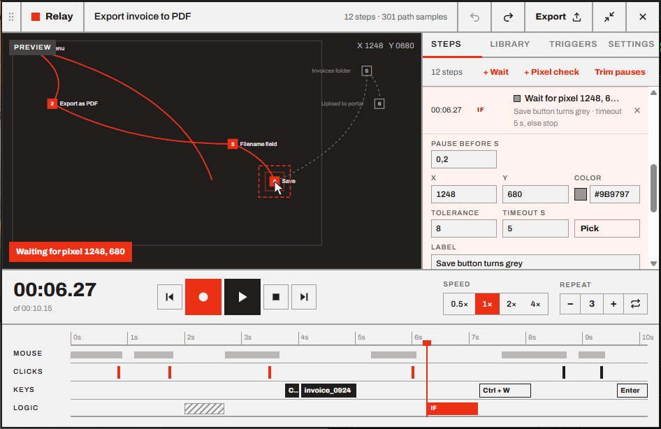
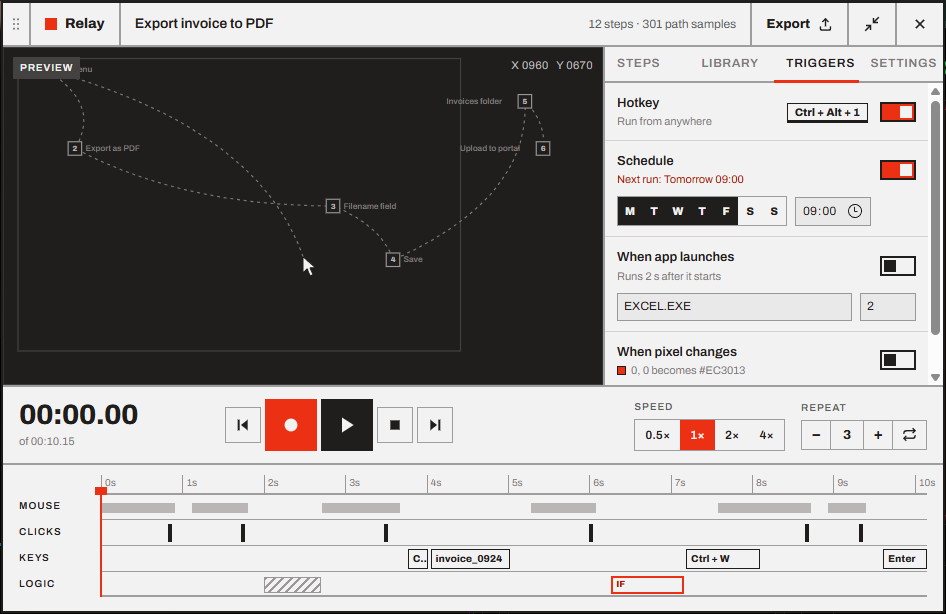
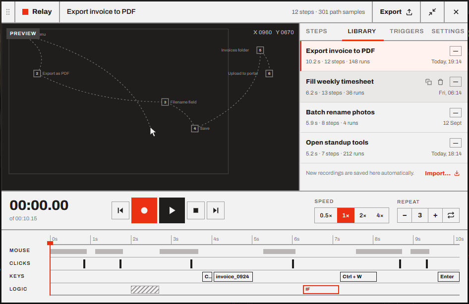

<h1 align="center">Relay</h1>

<p align="center">
  <b>Record what you do. Edit it as steps. Play it back on cue.</b><br>
  A macro recorder for Windows, with a timeline editor, pixel checks and triggers.
</p>

<p align="center">
  <a href="https://github.com/HappyRave/Relay/releases"></a>
  <a href="https://github.com/HappyRave/Relay/actions/workflows/ci.yml"></a>
  
  
  <a href="LICENSE"></a>
</p>

<p align="center">
  
</p>

<p align="center">
  <a href="https://github.com/HappyRave/Relay/releases"><b>Download</b></a> ·
  <a href="docs/user-guide/01-getting-started.md"><b>Get started</b></a> ·
  <a href="docs/user-guide/README.md">User guide</a> ·
  <a href="docs/engineering/README.md">Engineering guide</a>
</p>

## Features

| | |
| --- | --- |
| 🔴 **Record** | Press <kbd>F9</kbd> and work as usual. Every click, drag, scroll and keystroke is captured with its timing, across all your monitors and at any display scaling. |
| ✏️ **Edit as steps** | Recordings become readable steps: *Click · Save*, *Ctrl + S*, *"invoice_2026"*. Label them, delete them, add waits, trim the pauses. Undo anything. |
| ▶️ **Play back** | <kbd>F10</kbd> replays it at 0.5× to 4×, once, N times or forever, with optional *Humanize* timing. Accurate to about a millisecond. |
| 🎯 **Pixel checks** | Wait until something appears on screen before continuing, instead of guessing how long to wait. |
| ⏰ **Triggers** | Run a macro on a hotkey, on a weekly schedule, when an app starts, or when a pixel changes color. |
| 🛑 **Safe** | <kbd>Esc</kbd>, any key, or the <kbd>Ctrl</kbd>+<kbd>Alt</kbd>+<kbd>End</kbd> kill switch stops everything. Nothing is ever left pressed. |
| 📦 **Portable** | Macros are plain JSON `.rly` files. Export, import, back up, keep them in Git. |
| 🔒 **Private** | Everything stays on your PC. Relay never connects to the internet. |

<table>
<tr>
<td width="50%"><br><sub>Edit any step. Here, a pixel check.</sub></td>
<td width="50%"><br><sub>Hotkeys, schedules, app launches and pixel triggers.</sub></td>
</tr>
<tr>
<td width="50%"><br><sub>Playback with loops and a live timeline.</sub></td>
<td width="50%"><br><sub>Every recording saved in the Library.</sub></td>
</tr>
</table>

<p align="center"><br><sub>Or keep just the compact player on screen (<kbd>Ctrl</kbd>+<kbd>Shift</kbd>+<kbd>M</kbd>).</sub></p>

## Install

Get the [latest release](https://github.com/HappyRave/Relay/releases) in one of two forms:

| Download | What it is |
| --- | --- |
| **`Relay_x.y.z_x64-setup.exe`** | The installer. Installs for your user only, without administrator rights, and adds Relay to the Start menu. **Recommended.** |
| **`Relay_x.y.z_x64-portable.exe`** | The app on its own: nothing to install, run it from anywhere (a USB stick, a tools folder). Needs the WebView2 runtime, which Windows 11 includes. |

> [!NOTE]
> Neither is code-signed yet. If SmartScreen says *"Windows protected your PC"*, choose **More info → Run anyway**.

Then follow [Getting started](docs/user-guide/01-getting-started.md) to make your first macro in two minutes.

## Quick reference

| Key | Does |
| --- | --- |
| <kbd>F9</kbd> | Start or stop recording |
| <kbd>F10</kbd> | Play or pause |
| <kbd>Esc</kbd> | Stop (only while recording or playing) |
| <kbd>Ctrl</kbd>+<kbd>Shift</kbd>+<kbd>M</kbd> | Compact player ↔ editor |
| <kbd>Ctrl</kbd>+<kbd>Alt</kbd>+<kbd>End</kbd> | Kill switch: stop everything and pause triggers |

More in [Keyboard shortcuts](docs/user-guide/keyboard-shortcuts.md).

## Documentation

<table>
<tr>
<td width="50%" valign="top">

**📘 [User guide](docs/user-guide/README.md)**

- [Getting started](docs/user-guide/01-getting-started.md)
- [Recording](docs/user-guide/02-recording.md)
- [Editing steps](docs/user-guide/03-editing.md)
- [Playing back](docs/user-guide/04-playback.md)
- [Pixel checks](docs/user-guide/05-pixel-checks.md)
- [Triggers](docs/user-guide/06-triggers.md)
- [Library, export and import](docs/user-guide/07-library.md)
- [Settings, tray and window](docs/user-guide/08-settings.md)
- [Troubleshooting and FAQ](docs/user-guide/09-troubleshooting.md)

</td>
<td width="50%" valign="top">

**🛠️ [Engineering guide](docs/engineering/README.md)**

- [Architecture](docs/engineering/architecture.md)
- [relay-core](docs/engineering/core.md)
- [relay-platform](docs/engineering/platform.md)
- [The app](docs/engineering/app.md)
- [IPC](docs/engineering/ipc.md)
- [The frontend](docs/engineering/frontend.md)
- [File formats](docs/engineering/file-formats.md)
- [Testing and CI](docs/engineering/testing.md)
- [Contributing](CONTRIBUTING.md)

</td>
</tr>
</table>

## Good to know

- **Apps running as administrator** can't receive input from a normal app. Relay warns you. Run Relay as administrator to automate them.
- **Nothing runs on the lock screen** or during a UAC prompt. Triggers skip those moments.
- **Screen positions and physical keys** are replayed. A different monitor layout or keyboard layout can change the result. *Window* coordinates help when a window moves.
- **Recordings store what you type**, passwords included. Stop recording before typing secrets.
- **Games with anti-cheat** may ignore or penalize simulated input.

## Building from source

```bash
npm install
npm run tauri dev     # the app, with hot reload
npm run dev           # the UI alone in a browser, on a demo desktop
cargo test --workspace && npm test
npx tauri build       # the installer, in target/release/bundle/nsis
```

Relay is a Rust workspace (`relay-core` for the pure logic, `relay-platform` for the OS layer, `src-tauri` for the app) with a Svelte 5 UI. See [CONTRIBUTING.md](CONTRIBUTING.md) for requirements and conventions, and the [engineering guide](docs/engineering/README.md) for how it all fits together.

## Roadmap

- [x] **1.0**: recording, step editing, playback, pixel checks, triggers, library, tray, installer
- [x] **1.1**: undo and redo, editing and trimming pauses, waits inserted after the selected step, recording Esc
- [ ] AutoHotkey v2 and standalone `.exe` export
- [ ] Code signing
- [ ] Remapping macros to a different monitor layout
- [ ] macOS and Linux backends

See [CHANGELOG.md](CHANGELOG.md) for what changed in each version.

## License

Relay is free software under the [MIT License](LICENSE): use it, change it and share it, including commercially, as long as the copyright notice stays with it.
