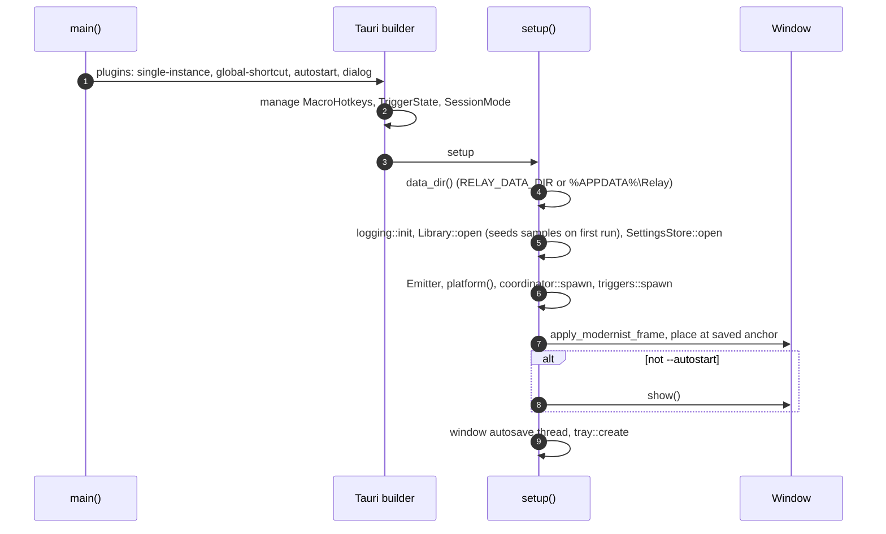
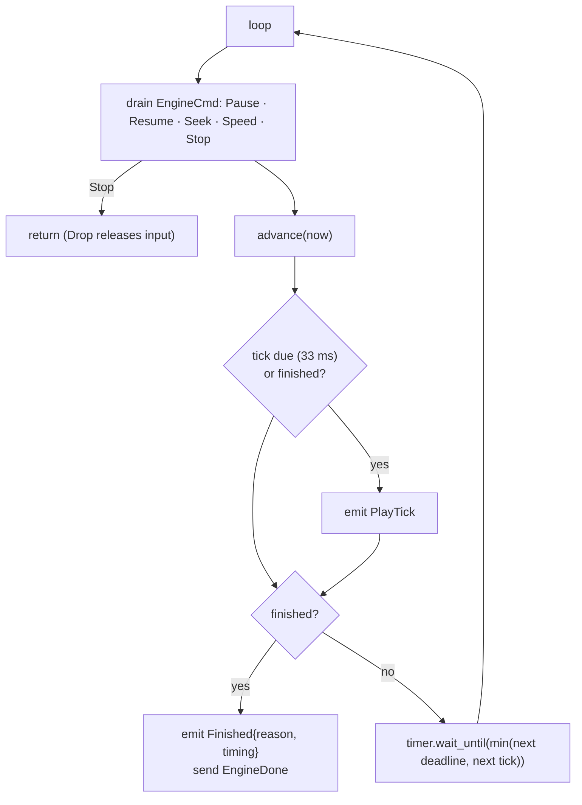

# The app (src-tauri)

`src-tauri` is the binary crate `relay`. It wires `relay-core` and `relay-platform` into a running app: threads, state, persistence, the window, the tray and the commands the UI calls.

- [Startup](#startup)
- [Managed state](#managed-state)
- [The coordinator](#the-coordinator)
- [The playback engine](#the-playback-engine)
- [The recorder thread and the hook watchdog](#the-recorder-thread-and-the-hook-watchdog)
- [Global hotkeys](#global-hotkeys)
- [Triggers](#triggers)
- [The library and storage](#the-library-and-storage)
- [Settings](#settings)
- [The window](#the-window)
- [The tray](#the-tray)
- [Logging and panics](#logging-and-panics)

| File | Lines | Role |
| --- | ---: | --- |
| [`lib.rs`](../../src-tauri/src/lib.rs) | 117 | Plugins, managed state, setup, window events |
| [`coordinator.rs`](../../src-tauri/src/coordinator.rs) | 521 | The session thread |
| [`engine.rs`](../../src-tauri/src/engine.rs) | 631 | Playback, with its tests |
| [`rec_thread.rs`](../../src-tauri/src/rec_thread.rs) | 158 | The recorder thread and the hook watchdog |
| [`hotkeys.rs`](../../src-tauri/src/hotkeys.rs) | 195 | Global and macro hotkeys |
| [`triggers.rs`](../../src-tauri/src/triggers.rs) | 157 | Schedule, app-launch and pixel threads |
| [`commands.rs`](../../src-tauri/src/commands.rs) | 397 | Tauri commands |
| [`history.rs`](../../src-tauri/src/history.rs) | 149 | Undo and redo of macro edits |
| [`ipc.rs`](../../src-tauri/src/ipc.rs) | 62 | `EngineMsg` and the `Emitter` |
| [`library.rs`](../../src-tauri/src/library.rs) | 408 | Macros on disk, trash, import |
| [`settings.rs`](../../src-tauri/src/settings.rs) | 87 | `settings.json` |
| [`storage.rs`](../../src-tauri/src/storage.rs) | 51 | Data directory, atomic writes |
| [`window_ctl.rs`](../../src-tauri/src/window_ctl.rs) | 254 | Placement, zoom, frame, focus |
| [`tray.rs`](../../src-tauri/src/tray.rs) | 103 | Tray icon and menu |
| [`logging.rs`](../../src-tauri/src/logging.rs) | 38 | Rolling logs, panic hook |

## Startup



- **Single instance**: a second launch calls `tray::show` on the first instance and exits.
- **The window starts hidden** (`"visible": false` in `tauri.conf.json`) and is shown only after it's been sized and placed, so it never jumps. Launched with `--autostart` (by the Windows *Run* key), it stays in the tray.
- **Closing**: `CloseRequested` is intercepted to hide the window when *Close to tray* is on.

## Managed state

Tauri's `app.manage` holds everything shared. Commands get it with `State<'_, T>`, threads through `AppHandle::state`.

| State | Type | Used by |
| --- | --- | --- |
| Library | `Mutex<Library>` | Commands, coordinator, triggers, hotkeys |
| Settings | `Mutex<SettingsStore>` | Commands, coordinator |
| Emitter | `Arc<Emitter>` | Everything that talks to the UI |
| Platform | `Arc<Platform>` | Commands (pixels, processes), coordinator, triggers |
| Coordinator | `CoordinatorHandle` (a `Sender<Cmd>`) | Commands, hotkeys, tray, triggers |
| Session mode | `SessionMode` (`RwLock<Option<Mode>>`) | Commands that must refuse while busy |
| Macro hotkeys | `MacroHotkeys` | Hotkey handler, `set_triggers` |
| Trigger pause | `TriggerState` (`AtomicBool`) | Triggers, coordinator, tray |
| Edit history | `EditHistory` | `edit_macro`, `undo_edit`, and every command that returns a `MacroView` |
| Window | `WindowState` | Window commands and events |

Locks are held briefly and never across a blocking call or while sending to another thread that might take the same lock.

## The coordinator

[`coordinator.rs`](../../src-tauri/src/coordinator.rs) is a thread that loops over `Receiver<Cmd>`:

```rust
pub enum Cmd {
    Input(Input),                 // ToggleRecord, TogglePlay{from}, Stop, Kill, …
    HotkeyPlay,                   // F10: play from the last idle playhead
    CountdownDone(u64),           // tagged with a generation
    Escape, StopKey,              // from the hook during a session
    EngineDone(FinishReason),
    Select(Uuid), Seek(f64), Speed(f64),
    RunMacro { id, source },      // a trigger or macro hotkey
    SetTriggersPaused(bool),
    HookLost,                     // from the watchdog
}
```

Every `Input` goes through `session::step`, and the coordinator performs the returned effects in order (see [the state machine](core.md#the-session-state-machine)). A few effects in detail:

**StartRecording**
1. Build a `HookConfig` with Relay's window rect and handle, `drop_vks: [F9]`, `record: true`, `swallow_escape` from the *Esc stops recording* setting, and start the hook with a bounded channel of 8,192 events.
2. Read the double-click settings, create a `Recorder`, and spawn the recorder thread.
3. If the hook fails, report the error and queue `Input::Stop` so the transition in progress completes first.

**StopRecording { keep }**
1. Stop the hook, `finish()` the recorder thread, and get the events.
2. If kept and meaningful, build `RecordingMeta` (OS, virtual desktop, monitors, double-click settings, and the **anchor window** under the first click), name it *Recording N*, `insert_front` into the library, and emit `Saved` and `LibraryChanged`.

**StartPlayback { from }**
1. Load the current macro. None? Report *Select a macro to play* and finish with `Error`.
2. **Hand the focus back**: if Relay is the foreground window (the play button was clicked), `restore_previous` activates the app the user was in.
3. **Elevation**: if the target is elevated and Relay isn't, emit a `Notice`.
4. **Window coordinates**: find the anchor window by exe and class, and use how far it moved as the offset. Missing? Emit a `Notice` and use screen coordinates.
5. **Click-through**: if any click (after the offset) lands inside the widget, make the window ignore the cursor for this playback.
6. Start a watch-only hook (`record: false`, `drop_vks: [F10]`, the macro's `stop_on_key`) and forward `Escape` and `StopKey` to the coordinator.
7. Build a `PlayPlan` and spawn the engine.

**EmitMode(mode)** updates `SessionMode`, the tray tooltip and `WS_EX_NOACTIVATE` on the window (set during sessions, so clicking the widget doesn't steal the focus), and emits `Session`. Returning to idle also tears down the playback hook and click-through.

Runs are counted (`runs += 1`, `last_run = now`) only when the engine reports `Completed`.

## The playback engine

[`engine.rs`](../../src-tauri/src/engine.rs) separates the **decision** from the **thread**:

- `Engine` is plain logic. `advance(now)` injects everything due at `now` and returns `Some(reason)` when done. It takes wall times as arguments and gets its injector and pixel reader as boxed traits, so tests drive it with a fake clock, a recording injector and a fake screen.
- `spawn` runs it on the `relay-engine` thread with the platform timer.



What `advance` does:

- Converts `now` to macro time with the `PlayClock` and dispatches every event whose planned time (from `plan_times`, with humanize) has passed. Each dispatch records its **lateness** (now − deadline) for the timing stats.
- **Move / Button / Wheel**: move to the position (+ the window offset) first, then press, release or scroll.
- **Key**: inject by scan code, virtual key, code or text (see [Injection](platform.md#injection)).
- **Tracks held input**: `keys_down` and `buttons_down`. `release_all` releases them newest first, and is called on stop, seek, loop end, pixel timeout and in `Drop`.
- **PixelWait**: seeks the clock to the check and **pauses** it, then polls the pixel every 30 ms. On a match, it seeks to the end of the `IF` block and resumes. After `timeout_ms`, it finishes with `PixelTimeout` and remembers the step number for the notice. Time paused by the user doesn't count toward the timeout.
- **End of the macro**: release everything, then either finish (`Completed`) or start the next loop with a fresh humanize seed.

`TimingStats { events, p50_ms, p99_ms, max_ms }` is logged and sent with `Finished`.

The first injection error (usually UIPI) is reported once as a `Notice`. Playback continues, since later events may go to another window.

## The recorder thread and the hook watchdog

[`rec_thread.rs`](../../src-tauri/src/rec_thread.rs) drains the hook channel into the `Recorder` and, every 100 ms:

- sends `RecProgress { elapsed_ms, desktop, moves, steps }`. `moves` holds only the cursor samples since the last message. `steps` is re-grouped and included only when something other than the cursor path changed, which keeps long recordings cheap.
- runs the **hook watchdog**.

Windows removes a low-level hook it considers too slow **without any notification**. The tell is a cursor that moves while no mouse events arrive:

```rust
// HookWatchdog::check(now, cursor): true when the hook looks dead
moved && now - last_event > 1000 ms && now - last_alarm > 5000 ms
```

On an alarm, the coordinator stops the old hook and starts a new one with the **same config and the same sender**, so the recorder keeps going with a small gap, and the user gets a notice.

`Esc` arrives on the same channel as `RawKind::Escape` and is forwarded to the coordinator as `Cmd::Escape`.

## Global hotkeys

[`hotkeys.rs`](../../src-tauri/src/hotkeys.rs) uses `tauri-plugin-global-shortcut`, which is `RegisterHotKey` on Windows. Unlike a low-level hook, it fires even when an elevated window is focused, and it never sees keys it isn't registered for.

**Which hotkeys are registered depends on the session**, so Relay only takes keys it needs right now:

| Set | Registered |
| --- | --- |
| `Idle` | F9, F10, Ctrl+Shift+M, Ctrl+Alt+End, and every enabled macro hotkey |
| `Recording` | F9, Ctrl+Alt+End |
| `Playing` | F10, Ctrl+Alt+End |

`apply(set)` unregisters everything and registers the set, under a mutex, since both the coordinator and the `set_triggers` command call it. For macro hotkeys it records failures per macro: a duplicate combo (*used by another macro*) or a registration failure, which means another app owns it (*taken by another app*). `TriggerStatus.hotkey_error` shows the reason in the UI.

`parse_combo("Ctrl + Alt + 1")` turns the UI's labels into a `Shortcut`, requiring a modifier unless the key is F1–F24. `conflict()` refuses Relay's own combos and those of other enabled macros **before** saving.

## Triggers

[`triggers.rs`](../../src-tauri/src/triggers.rs) runs three threads. Each takes a snapshot of every macro's triggers from the library on each poll, so changes apply without restarting anything.

| Thread | Period | Logic |
| --- | --- | --- |
| `relay-schedule` | 5 s | For each enabled schedule, compute `next_run` from the **previous tick's time**. If it's ≤ now, fire it, unless it's more than 2 minutes late (the PC slept), in which case log and skip. Comparing wall-clock times each tick survives sleep and clock changes. |
| `relay-app-launch` | 2 s | One `ProcessWatcher`. A `ProcessLaunchEdge` per (macro, exe). On a launch edge, a short-lived thread sleeps `delay_ms`, then fires. |
| `relay-pixel-trigger` | 250 ms | A `PixelEdge` per macro, reset when the watched position changes. Samples `Screen::pixel` and fires on the edge. |

`fire()` checks `TriggerState::paused` and sends `Cmd::RunMacro`. The coordinator then:

1. ignores it if triggers are paused (checked again, since the kill switch may have been pressed in between),
2. emits *Skipped "…": Relay was busy* if not idle,
3. logs and skips if `input_desktop_available()` is false (lock screen, UAC),
4. otherwise selects the macro and feeds `Input::Trigger(source)`, which plays from 0.

The kill switch's `PauseTriggers` effect sets `TriggerState`, unchecks the tray's *Triggers active* item and emits `TriggersPaused`.

## The library and storage

[`library.rs`](../../src-tauri/src/library.rs) keeps every macro in memory (`Vec<Entry>`, in Library order) and mirrors changes to disk immediately:

| Operation | Disk effect |
| --- | --- |
| `insert_front`, `save` | Write `macros/<id>.rly`, then `library.json` |
| `duplicate` | New id, unique name "… (copy)", no triggers, inserted after the original |
| `trash` | Move the file to `macros/.trash/`, remember its position and stats in `library.json` |
| `restore` | Move it back, at its old position, with its stats and triggers |
| `import` | New id if the id is already in the library or the trash, unique name, inserted at the top |
| `set_triggers` | `library.json` |

`Library::open` loads every `.rly` in `macros/` (skipping and logging broken files), orders them by `library.json` (files it doesn't list go last, newest first), and attaches stats and triggers. With no index and no files, it **seeds the four samples**, with their design hotkeys present but disabled.

[`storage.rs`](../../src-tauri/src/storage.rs): the data directory is `%APPDATA%\Relay`, or `RELAY_DATA_DIR` if set. `write_atomic` writes a temp file and renames it over the target, so a crash never leaves a half-written file.

## Undo history

[`history.rs`](../../src-tauri/src/history.rs): `EditHistory` keeps, per macro id, an undo and a redo stack of snapshots (the `name` and `events`, the only things edits change), up to 100 deep, in memory only.

- `edit_macro` clones the macro, applies the `EditOp`, and on success calls `record(id, &before, &op)`, which pushes the snapshot and clears the redo stack. Renames less than 2 s apart are one entry, since the UI saves the name as it's typed.
- `undo_edit(id, redo)` swaps the current state with the top of one stack, pushes it on the other, and saves the `.rly`.
- `view_of(macro, history)` fills `MacroView.can_undo` and `can_redo`, so every view the UI gets knows whether its buttons are enabled.

Playback options and triggers aren't edits and bypass the history.

## Settings

[`settings.rs`](../../src-tauri/src/settings.rs): `Settings` is `#[serde(default)]`, so missing or unknown fields fall back to defaults and older files keep loading. `update_settings` replaces the whole struct and saves atomically. Recording settings are read when a recording starts, so changes apply to the next one.

## The window

[`window_ctl.rs`](../../src-tauri/src/window_ctl.rs) positions the widget from Rust, since only Rust knows the monitors' physical geometry.

- **The anchor** is the widget's **bottom-center** in physical pixels, saved in `window.json`. Placing a widget of a given CSS size means: find the monitor containing the anchor (or the primary monitor if it's gone), compute the zoom, size the window, center it horizontally on the anchor with its bottom on the anchor, and clamp it inside the work area with a 16 px margin. The default anchor is centered, 24 px above the bottom of the primary work area.
- **Zoom**: the expanded widget is 944 × 612 CSS px. On a work area too small for that (at the monitor's scale), `webview.set_zoom` scales it down to fit, clamped to 40–100%.
- **Compact ↔ expanded**: the UI calls `fit_window(width, height, expanded)` with its measured size. The bottom-center stays put, so the widget grows upward.
- **Moves** are tracked in `WindowEvent::Moved` and saved half a second after dragging stops. `ScaleFactorChanged` re-places the window.
- **Frame**: on Windows 11, `DWMWA_WINDOW_CORNER_PREFERENCE = DONOTROUND` and `DWMWA_BORDER_COLOR = NONE`, so the window has the design's square corners and its own 2 px ink border.
- **Focus**: `WS_EX_NOACTIVATE` during sessions, and `set_ignore_cursor_events` for click-through (see the coordinator).

## The tray

[`tray.rs`](../../src-tauri/src/tray.rs): left-click toggles the window. The menu has *Show / hide Relay*, *Record*, *Stop*, the *Triggers active* check item, *Open macros folder* and *Quit Relay*. The tooltip follows the session mode (*Relay — recording (F9 to stop)*).

## Logging and panics

[`logging.rs`](../../src-tauri/src/logging.rs) sets up `tracing` with a daily rolling file in `logs/` (`relay.YYYY-MM-DD.log`, 7 kept), non-blocking, at INFO level. A panic hook logs the thread name and message before the default hook runs.

Log lines record **what happened** (session transitions, recordings saved with their event counts, triggers fired or skipped, playback timing, errors), **never what was typed**. Keep it that way when adding logs.

The release profile uses `panic = "unwind"` (the default, deliberately not `abort`): a panic on the engine thread unwinds through `Engine`'s `Drop`, which releases every held key and button.

---

<p align="center"><a href="platform.md">← relay-platform</a> · <a href="README.md">Contents</a> · <a href="ipc.md">IPC →</a></p>
