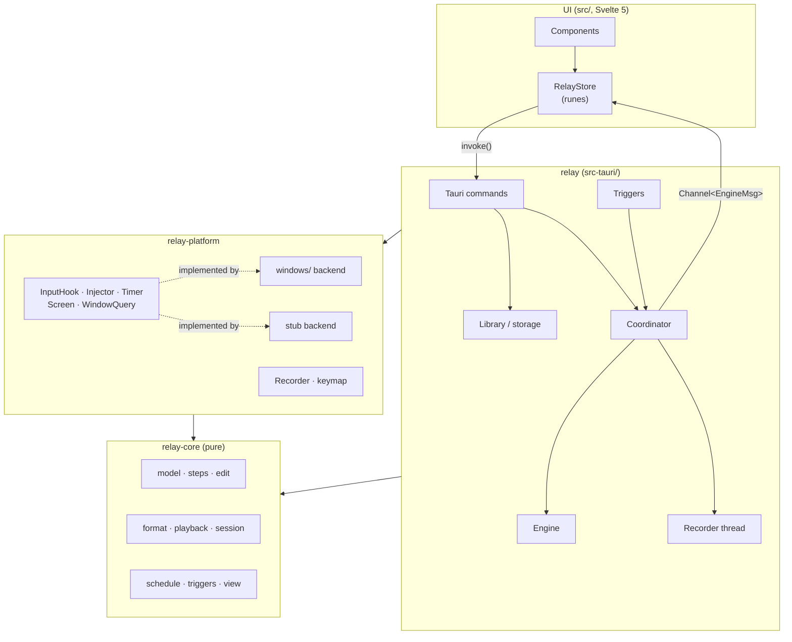
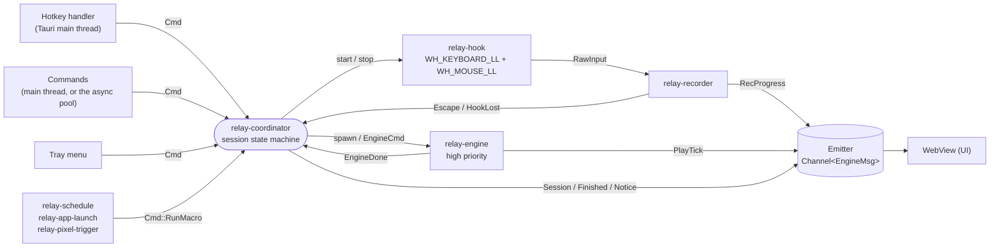
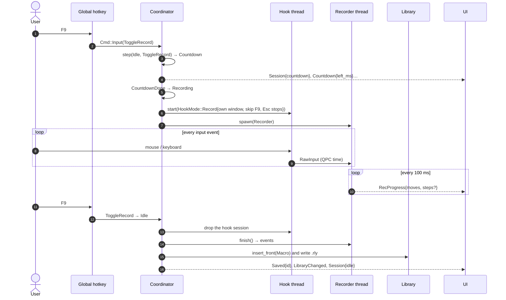
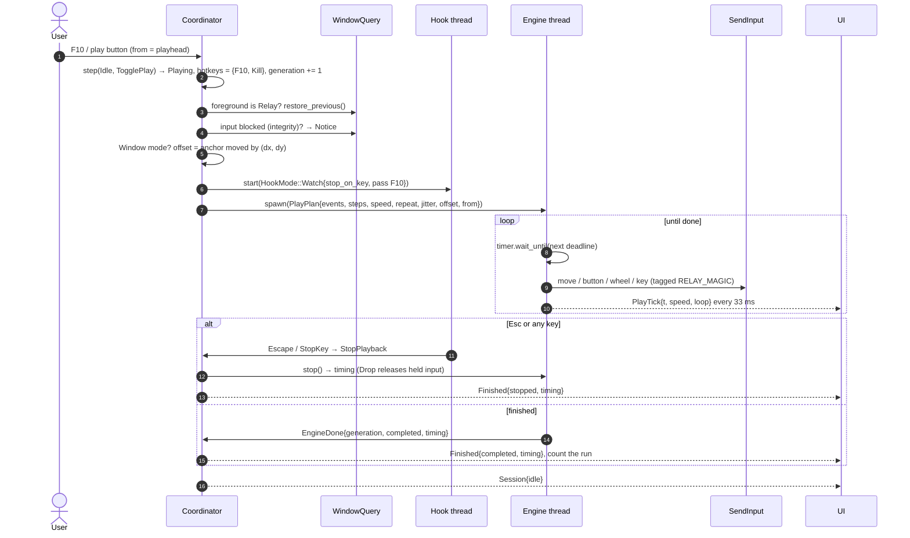
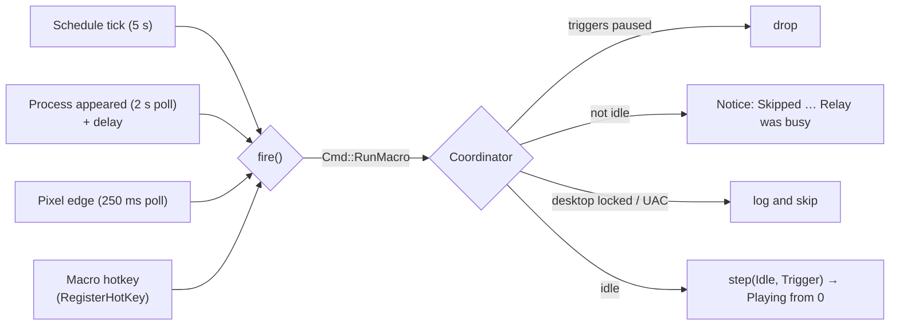

# Architecture

Relay is a Tauri 2 app: a Rust process that owns everything OS-related and all state, and a Svelte UI in a WebView2 window that shows it. The Rust side is split into three crates so the logic that matters most can be tested without Windows.

- [The crates](#the-crates)
- [Threads](#threads)
- [How a recording flows](#how-a-recording-flows)
- [How a playback flows](#how-a-playback-flows)
- [How a trigger flows](#how-a-trigger-flows)
- [Design principles](#design-principles)
- [Repository layout](#repository-layout)

## The crates



| Crate | Path | Depends on | Role |
| --- | --- | --- | --- |
| **relay-core** | `crates/relay-core` | serde, chrono, uuid, ts-rs | **Pure logic, no I/O.** The macro model, step grouping, edit operations, the `.rly` format and migrations, the playback clock and humanize, the session state machine, schedules and trigger edge detectors. Builds and tests on any OS. |
| **relay-platform** | `crates/relay-platform` | relay-core, `windows` | **The OS boundary.** Traits for input hooks, injection, timers, screen and window queries, a Windows backend, and a stub for other systems. The recorder (raw input → events) and the key map are OS-independent and live here too. |
| **relay** | `src-tauri` | both, Tauri 2 and plugins | **The app.** Threads, state, persistence, commands for the UI, the tray, the window and triggers. |

The UI never touches the OS or the files. It calls commands and listens to one message stream (see [IPC](ipc.md)).

## Threads

Relay is a handful of long-lived threads that talk over [crossbeam](https://crates.io/crates/crossbeam-channel) channels. Nothing shares mutable state except behind a `Mutex` held briefly (the library and settings).



| Thread | Lives | Does |
| --- | --- | --- |
| **relay-coordinator** | Whole run | Owns the session mode. Applies `session::step`, then performs the effects: start or stop the hook, recorder and engine, ask for the global hotkeys of the new state, emit mode changes. Runs the recording countdown in its own loop. The single place where sessions change. |
| **relay-hook** | During a session | Installs the low-level hooks and pumps their messages. Callbacks only filter, timestamp and `try_send`. |
| **relay-recorder** | While recording | Turns raw input into events, sends live progress 10 times a second, runs the hook watchdog. |
| **relay-engine** | While playing | Injects events on time with the precision timer, polls pixel checks, reports ticks 30 times a second. Runs at `THREAD_PRIORITY_HIGHEST`. |
| **relay-schedule**, **relay-app-launch**, **relay-pixel-trigger** | Whole run | Poll every 5 s, 2 s and 250 ms, and ask the coordinator to run a macro when a trigger fires. |
| **Tauri main thread** | Whole run | The window, the tray, the global hotkey handler (`RegisterHotKey` messages arrive here), hotkey registration, and the commands that don't write files. |
| **relay-stop-keys** | While playing | Forwards Esc and stop keys from the watching hook to the coordinator. |

## How a recording flows



What happens to an event on the way:

1. **Hook callback** ([`windows/hook.rs`](../../crates/relay-platform/src/windows/hook.rs)): drops Relay's own injected input (tagged with `RELAY_MAGIC` in `dwExtraInfo`) and, by default, anyone else's injected input. It leaves out clicks on Relay's window (the window under the cursor), keys typed while Relay is in front, and F9, and a release always goes the way its press went. Esc is swallowed and reported as `RawKind::Escape`. Everything else is timestamped with `QueryPerformanceCounter` and sent without blocking.
2. **Recorder** ([`recorder.rs`](../../crates/relay-platform/src/recorder.rs)): converts to macro time, throttles cursor samples to one per 16 ms, translates key presses into the characters they type (with the current layout, without disturbing dead keys), maps scan codes to W3C key codes, and drops the kill switch.
3. **On stop**: trailing modifiers (the Ctrl and Alt of a kill switch) are trimmed, presses are balanced by `normalize`, and a recording without real content is discarded. The window under the first click becomes the macro's *anchor window*.

## How a playback flows



The engine computes each event's deadline from a `PlayClock` (macro time = anchor + (wall time − anchor wall) × speed), sleeps until it with a high-resolution waitable timer plus a 1 ms spin, and injects. Speed changes, pauses and seeks re-anchor the clock, so timing never drifts. In a 10-minute soak test, 12,000 events were injected with a p99 lateness of 0.008 ms and a maximum of about 1 ms.

## How a trigger flows



The trigger threads don't decide whether a macro can run. They only detect the event and send `Cmd::RunMacro`. The coordinator, which knows the session mode and whether triggers are paused, decides. See [The app → Triggers](app.md#triggers).

## Design principles

- **A pure core.** Everything that can be a pure function is one, in `relay-core`: grouping, edits, the clock, the session state machine, schedules. They take time as a parameter (`now: f64`) instead of reading a clock, so they're tested exhaustively, including with property tests, and run on Linux CI.
- **One owner per piece of state.** The coordinator owns the session. The engine owns what it pressed. The hook thread owns the hooks. Other threads send messages.
- **Never wait on the main thread while holding a lock.** Window, tray and hotkey calls from other threads block until the main thread runs them; hotkey registration only ever runs there.
- **Effects, not calls.** `session::step(mode, input) → (mode, effects)` returns what should happen, and the coordinator performs it. The table of transitions is readable in one screen, and tests assert it.
- **Never leave input stuck.** The engine tracks every key and button it pressed and releases them on stop, seek, loop end, `Drop` and panic (the release profile unwinds instead of aborting for this reason). Edits keep presses balanced.
- **Don't fight Windows.** Hook callbacks do the minimum, since Windows silently removes slow hooks (and Relay detects and reinstalls one when it happens). Hotkeys go through `RegisterHotKey`, which works even when an elevated window is in front. Elevated targets, the lock screen and UAC are detected and explained instead of failing silently.
- **Local and private.** No network. Files are plain JSON, written atomically. Logs record what happened, never what was typed.
- **Portable later.** OS access is behind traits, so a macOS or Linux backend is a new module in `relay-platform`, not a rewrite.

## Repository layout

```text
Relay/
├── crates/
│   ├── relay-core/          pure logic (model, steps, edit, format, playback, session, schedule, triggers, view)
│   │   └── src/snapshots/   insta snapshots of the file format
│   └── relay-platform/      OS traits, recorder and key map
│       └── src/windows/     hook, inject, timer, screen, window, text
├── src-tauri/               the app
│   ├── src/                 coordinator, engine, rec_thread, hotkeys, triggers, commands, ipc, library, …
│   ├── tauri.conf.json      window, bundle and installer config
│   └── app.manifest         PerMonitorV2 DPI awareness
├── src/                     the Svelte UI
│   ├── components/          widget, compact bar, expanded editor, tabs, dialogs
│   ├── lib/state/           the RelayStore
│   ├── lib/ipc/             backend abstraction and generated bindings
│   └── styles/              design tokens and base styles
├── Design/                  the Claude Design source files
├── docs/                    this documentation
└── .github/workflows/       CI and releases
```

---

<p align="center"><a href="README.md">← Engineering guide</a> · <a href="README.md">Contents</a> · <a href="core.md">relay-core →</a></p>
