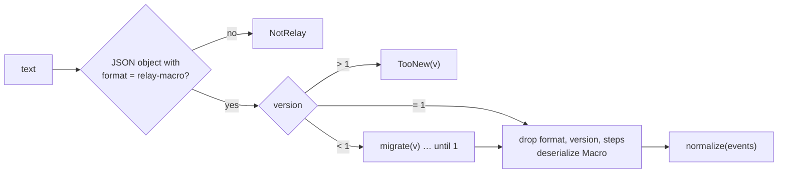
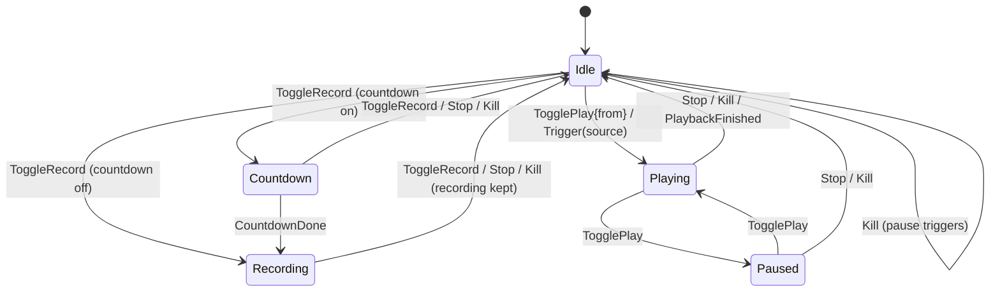

# relay-core

`crates/relay-core` holds everything about macros that doesn't need an operating system. It has no I/O, and everything time-dependent (the playback clock, schedules, trigger edges) takes `now` as an argument instead of reading a clock. That keeps it fast to test, deterministic, and portable (CI tests it on Linux). The only clock reads are creation and edit timestamps (`created_at`, `modified_at`).

- [Modules](#modules)
- [The model](#the-model)
- [Keys](#keys)
- [Step grouping](#step-grouping)
- [Edits and invariants](#edits-and-invariants)
- [The file format](#the-file-format)
- [Playback timing](#playback-timing)
- [The session state machine](#the-session-state-machine)
- [Schedules](#schedules)
- [Trigger edges](#trigger-edges)
- [Views for the UI](#views-for-the-ui)

## Modules

| Module | Contents |
| --- | --- |
| [`model`](../../crates/relay-core/src/model.rs) | `Macro`, `Event`, `RecordingMeta`, `PlaybackOptions`, `Rgb`, `Rect`, `MonitorInfo`, `WindowInfo` |
| [`keys`](../../crates/relay-core/src/keys.rs) | `KeyStroke`, modifiers, key labels, `code_for_label`, `key_for_char` |
| [`steps`](../../crates/relay-core/src/steps.rs) | `group_steps`: raw events → `Step`s |
| [`edit`](../../crates/relay-core/src/edit.rs) | `EditOp`, `apply`, `normalize`, `check_invariants` |
| [`format`](../../crates/relay-core/src/format.rs) | `.rly` serialization, the JSON export, loading and migrations |
| [`playback`](../../crates/relay-core/src/playback.rs) | `PlayClock`, `plan_times` (humanize) |
| [`session`](../../crates/relay-core/src/session.rs) | `Mode`, `Input`, `Effect`, `step` |
| [`schedule`](../../crates/relay-core/src/schedule.rs) | `WeeklySchedule`, `next_run` |
| [`triggers`](../../crates/relay-core/src/triggers.rs) | `MacroTriggers`, `PixelEdge`, `ProcessLaunchEdge` |
| [`timeline`](../../crates/relay-core/src/timeline.rs) | `duration`, shared by the editor and the engine |
| [`view`](../../crates/relay-core/src/view.rs) | `MacroView` and `MacroListItem`, what the UI receives |
| [`samples`](../../crates/relay-core/src/samples.rs) | The four sample macros from the design |
| [`proptests`](../../crates/relay-core/src/proptests.rs) | Property tests for grouping and edits |

Every type the UI sees derives [`ts_rs::TS`](https://crates.io/crates/ts-rs), so its TypeScript definition is generated (see [IPC](ipc.md#generated-bindings)).

## The model

A macro is **a flat, time-sorted list of low-level events** plus metadata. Steps are never stored: they're derived from the events every time. That means there's one source of truth, and grouping can improve without migrating files.

```rust
pub struct Macro {
    pub id: Uuid,
    pub name: String,
    pub created_at: DateTime<Utc>,
    pub modified_at: DateTime<Utc>,
    pub recording: RecordingMeta,   // OS, monitors, double-click settings, anchor window
    pub playback: PlaybackOptions,  // speed, repeat, humanize, jitter_ms, stop_on_key, coord_mode
    pub events: Vec<Event>,
}

pub enum Event {
    Move      { t, x, y },
    Button    { t, x, y, btn, down, label },          // label lives on the down event
    Wheel     { t, x, y, delta, horizontal },          // delta in WHEEL_DELTA units (120 = one notch)
    Key       { t, down, key: KeyStroke, ch },         // ch: the character it typed, if any
    Wait      { t, dur, label },
    PixelWait { t, dur, x, y, color, tolerance, timeout_ms, label },
}
```

- **Time** `t` is milliseconds from the start of the recording (`Ms = u32`). `Wait` and `PixelWait` also have a duration, so `Event::end()` is `t + dur` for them and `t` otherwise.
- **Positions** are physical pixels on the virtual desktop (all monitors, origin at the primary monitor's top-left, possibly negative).
- **`Rgb`** serializes as `"#RRGGBB"`. `within(other, tolerance)` compares each channel independently.
- **`Repeat`** is `{"count": n}` or `"forever"`; `Repeat::loops()` gives the count (at least 1) or `None`.

Defaults for a new macro: speed 1, repeat once, humanize on with ±40 ms, stop on key press on, screen coordinates.

## Keys

A key is identified by its [W3C `code`](https://www.w3.org/TR/uievents-code/) ("KeyA", "ControlLeft", "Enter"), which names the **physical key** and is the same on every layout. The Windows virtual key and scan code are kept alongside for faithful replay:

```rust
pub struct KeyStroke { pub code: String, pub vk: u16, pub scan: u16, pub ext: bool }
```

`keys::label` and `key_label` turn a key into what the UI shows. For letters and digits they use the **virtual key**, which follows the layout, so the AZERTY key in the QWERTY "Q" position shows as **A**. Other keys have fixed names (*Enter*, *PgUp*, *Del*, *Num 5*). `code_for_label` goes the other way, for parsing hotkey combos. `key_for_char` maps a character to a US key, and is used by the v0 migration.

## Step grouping

`group_steps(events, GroupOptions { double_click_ms, double_click_px })` makes one pass over the events and produces the editor's steps. Each `Step` has a start `t`, an `end`, a `pause`, the `items` (indices of the events it owns) and a `kind`:

| Kind | Rule |
| --- | --- |
| `Click { count }` | A button down starts a click. Its up joins it. If the pointer moved more than **`CLICK_SLOP_PX` = 4** (Chebyshev distance), it becomes a **Drag**. A click that directly follows a click of the same button, within the system double-click time and distance (recorded in `RecordingMeta`), merges into it and increments `count`. |
| `Drag { to_x, to_y }` | See above |
| `Scroll { delta }` | Wheel events in the same direction and axis less than **`SCROLL_GAP_MS` = 300** apart merge, summing `delta` |
| `Type { text, chars }` | A key down that produced a printable character, **without** Ctrl, Alt or Win held (AltGr counts as typing, not as Ctrl + Alt), joins the previous `Type` step if its last character was less than **`TYPE_GAP_MS` = 500** earlier |
| `Keys { combo }` | Any other key down: the held modifiers (always in the order Ctrl, Alt, Shift, Win), then the key's label, e.g. `["Ctrl", "Shift", "S"]` |
| `Wait`, `PixelWait` | One step per event |

Details that matter:

- **Moves belong to no step.** They're the path between steps.
- **Auto-repeat** of a held key extends its step instead of creating new ones (and adds characters to a `Type` step).
- **Modifier presses** are tracked separately. A modifier's down and up events are attached to the step it wrapped (a shortcut, a Shift-click, a Ctrl-scroll) if it wrapped exactly one, and that step's `t`..`end` widens to cover them, so inserting or retiming around a shortcut never separates it from its modifier. A modifier tapped alone (like the Win key) becomes its own `Keys` step. A modifier held across several steps belongs to none. When two clicks merge into a double click, modifiers that wrapped the second follow the merge.
- **Releases** join the step of their press, and extend its `end`.
- **`pause`** is computed last: the time between the latest `end` of all earlier steps (or 0) and this step's `t`, or 0 when they overlap. It's the recorded idle time, when only the cursor moves.

Every non-move event belongs to **at most one** step. That's what makes "delete this step" well-defined: delete its `items`.

## Edits and invariants

The UI edits macros only through `EditOp`, applied by `edit::apply(&mut Macro, op)`:

| Op | Effect |
| --- | --- |
| `Rename { name }` | Sets the name (the UI debounces typing) |
| `DeleteStep { index }` | Removes the step's items. For a wait or pixel check, shifts everything after it earlier by its duration. Then `normalize`. |
| `InsertWait { at, dur, label }` | Snaps `at` past any step with `t ≤ at ≤ end` (to its `end + 1`), shifts every event at or after `at` later by `dur`, inserts. Since clicking a step seeks to its `t`, this means "insert after the selected step", and a step is never split. |
| `InsertPixelWait { … }` | The same, with a `PixelWait` |
| `SetWaitDuration { index, dur }` | Shifts everything after the wait by the difference |
| `UpdatePixelWait { index, x, y, color, tolerance, timeout_ms }` | Replaces the check's parameters. Its time and duration don't change. |
| `SetLabel { index, label }` | On a click or drag (stored on the button-down event), a wait or a pixel check |
| `SetPause { index, dur }` | Retimes the pause before the step, from `t − pause` to `t`: events inside it (cursor moves, a shared modifier's release) are scaled linearly to fit the new length, events at or after `t` shift by the difference. The mapping is monotone, so order and balance are kept. |
| `CapPauses { max }` | `SetPause` to `max` for every pause above it, from last to first so the precomputed pauses stay valid |

Steps are addressed by index into `group_steps` of the current events. The UI always re-renders from the `MacroView` an edit returns, so indices can't go stale.

Times are `u32` milliseconds, and the arithmetic saturates rather than overflowing, even on a hand-edited file with absurd values. Edits cap the durations they set at a day (`MAX_DUR`).

**`normalize`** is the safety net that runs after deletions, after loading any file and at the end of every recording:

1. sort events by time (stable),
2. drop a release whose press is missing (it happened before recording started),
3. drop a second button-down without an up (keys may repeat, buttons may not),
4. release anything still held at the end, newest first, at the time of the last event.

**`check_invariants`** states what must always hold, and the property tests generate random recordings and random sequences of edits to check it:

- events are sorted by time,
- `normalize` is a no-op (presses are balanced),
- no event happens inside a wait or pixel check.

## The file format

`format::to_rly` writes a compact JSON envelope, `{"format": "relay-macro", "version": 1, ...macro}`. `to_export_json` pretty-prints the same thing plus the derived `steps`, for humans and scripts.

`format::from_rly` loads any version:



Migrations work on `serde_json::Value`, so old shapes never need Rust types. `migrate_v0` converts the M0 prototype's high-level events (`click`, `key` combos like `"Ctrl + A"`, `char`, `wait`, `cond`) into v1 presses and releases, with a single 1080p `RecordingMeta`. Snapshot tests pin both the v1 output and the migration result. See [File formats](file-formats.md) for the full schema.

## Playback timing

### The clock

`PlayClock` maps wall time to macro time:

```text
macro_t(now) = anchor_t + (now − anchor_wall) × speed      (while playing)
macro_t(now) = anchor_t                                    (while paused)
deadline(t)  = anchor_wall + (t − anchor_t) / speed
```

Every change (`set_speed`, `pause`, `resume`, `seek`) **re-anchors**: it stores the current macro time and wall time as the new anchor. Errors can't accumulate, so an hour-long loop is as precise as the first second.

Loops are the engine's job (see [The app → The playback engine](app.md#the-playback-engine)): at the end of a loop it seeks the clock back by the loop's length, carrying the overshoot into the next loop so loops don't drift.

### Humanize

`plan_times(events, steps, jitter_ms, seed) → Vec<f64>` gives each event its play time:

1. For each step, draw one offset uniformly in **±jitter** from a seeded RNG ([`fastrand`](https://crates.io/crates/fastrand)). All of a step's events get the same offset, so a click's press and release (or a combo's modifiers and key) move together.
2. Events outside steps (the cursor path) take the offset of the step before them, so the path stays attached to its clicks.
3. Times are clamped to be **non-decreasing and non-negative**. A release can never come before its press, and steps can never swap.

The engine calls it again with a different seed at each loop, so every loop has its own pattern.

## The session state machine

`session::step(mode, input, config) → (new_mode, effects)` is the whole session logic, in one pure function:



The effects it returns, in order, are what the coordinator performs:

| Effect | Performed as |
| --- | --- |
| `StartCountdown { ms }`, `CancelCountdown` | A deadline in the coordinator's own loop, which waits with a timeout while it's set |
| `StartRecording`, `StopRecording` | Hook and recorder threads (a stopped recording is always kept) |
| `StartPlayback { from }`, `PausePlayback`, `ResumePlayback`, `StopPlayback(reason)` | The engine thread; the reason (`stopped`, `key_pressed`, `killed`) goes to the UI |
| `SetHotkeys(Idle \| Recording \| Playing)` | Re-register the global hotkeys for that state |
| `PauseTriggers` | After the kill switch |
| `EmitMode(mode)` | Always last on a transition: tell the UI, the tray and the window |

`Input::Stop` carries its reason too (`Esc` and the stop button: `stopped`; another key with *Stop on key press*: `key_pressed`), so it travels with the transition instead of through a side field. Every input not listed is ignored: F9 while playing, F10 while recording, a `PlaybackFinished` after a stop, a trigger while busy (the coordinator tells the user it was skipped). Tests cover each transition.

## Schedules

`WeeklySchedule { days: [bool; 7], time: NaiveTime }` (Monday first, `"HH:MM"` in JSON, default weekdays at 09:00).

`next_run(now, schedule)` returns the first matching instant **strictly after** `now`, in `now`'s time zone, looking up to 7 days ahead. It's generic over `chrono::TimeZone`, so tests use fixed zones. Daylight saving is handled explicitly:

- a time that **doesn't exist** (spring forward) runs at the first valid minute after the gap,
- a time that **happens twice** (fall back) runs at the earlier one.

## Trigger edges

The polling triggers feed one sample per poll into an edge detector and fire on the edge, not the level:

| Detector | Fires when | Why |
| --- | --- | --- |
| `ProcessLaunchEdge` | The process is present now and was absent at the previous sample. The first sample is only a baseline. | An app already running when Relay starts (or when the trigger is turned on) must not fire. |
| `PixelEdge` | The pixel matches on **two consecutive** samples after at least one non-matching sample. It re-arms only after a non-match. | A single-frame flicker doesn't fire, and a pixel that stays red fires once. |

## Views for the UI

The UI never receives raw events. `MacroView::of(&Macro)` sends the id, name, recording metadata, playback options, the **derived steps**, the **cursor path** (`MovePoint`s from moves and button events) and the **duration** (end of the last event + 500 ms of tail; 2 s for an empty macro). `MacroListItem` is a Library row, built by the app's library from counts it caches.

---

<p align="center"><a href="architecture.md">← Architecture</a> · <a href="README.md">Contents</a> · <a href="platform.md">relay-platform →</a></p>
