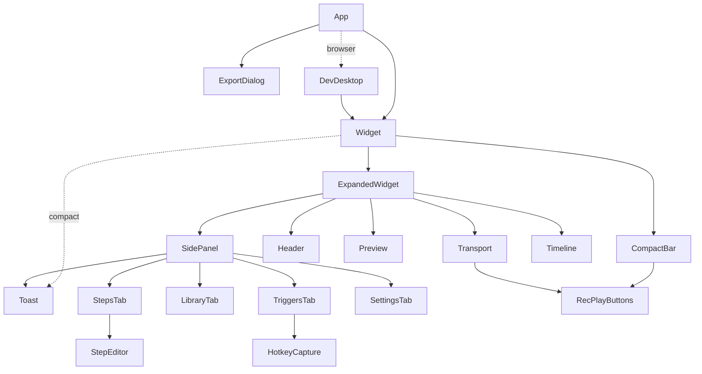

# The frontend

The UI in [`src/`](../../src) is Svelte 5 with runes, TypeScript and Vite 8, with no component library. It renders state and sends intentions. It doesn't own any session logic: the Rust coordinator does.

- [Structure](#structure)
- [The store](#the-store)
- [The backend abstraction](#the-backend-abstraction)
- [The browser preview](#the-browser-preview)
- [Components](#components)
- [The preview and the timeline](#the-preview-and-the-timeline)
- [Styling](#styling)
- [The window from the UI's side](#the-window-from-the-uis-side)
- [Conventions](#conventions)

## Structure

```text
src/
├── main.ts                     mounts App
├── App.svelte                  the Widget in Tauri, the DevDesktop in a browser, the Export dialog
├── components/
│   ├── Widget.svelte           the compact player measures itself; the editor fills the window
│   ├── CompactBar.svelte       the 604 × 68 player bar
│   ├── ExpandedWidget.svelte   header, preview, side panel, transport, timeline
│   ├── ExportDialog.svelte
│   ├── expanded/               Header, Preview, SidePanel, Transport, Timeline
│   │   └── tabs/               StepsTab, StepEditor, LibraryTab, TriggersTab, SettingsTab
│   ├── shared/                 Grip, RecPlayButtons, Toast
│   ├── ui/                     Toggle, Segmented, Kbd, Icon, HotkeyCapture
│   └── dev/DevDesktop.svelte   the demo desktop for the browser preview
├── lib/
│   ├── state/relay.svelte.ts   the RelayStore
│   ├── state/selection.ts      which step the open editor follows across edits
│   ├── state/display.ts        badge labels, step titles
│   ├── fields.ts               number fields: parse, round, clamp, show the committed value
│   ├── defaults.ts             default settings and playback options (shared with the browser preview)
│   ├── ipc/backend.ts          Tauri and browser backends
│   ├── ipc/bindings/           generated from Rust (don't edit)
│   ├── types.ts                re-exports of the bindings, UI-only types
│   ├── format.ts               time, names, "Next run", "Last run"
│   ├── hotkeys.ts              KeyboardEvent → "Ctrl + Alt + 1"
│   ├── timeline/lanes.ts       lane geometry, current step, prev/next
│   ├── preview/geometry.ts     SVG path, cursor lookup, fitting the view
│   ├── actions/seekable.ts     click-and-drag to seek
│   ├── platform/window.ts      isTauri, fit_window, window prefs and panes, dragging, hide to tray
│   ├── layout.ts               the editor's dividers kept inside the window (paneLayout)
│   └── dev/                    the browser fixture and demo desktop state
└── styles/                     tokens.css, base.css, components.css, app.css
```

## The store

[`lib/state/relay.svelte.ts`](../../src/lib/state/relay.svelte.ts) exports one `RelayStore` instance, `relay`. Components import it and read its fields directly. Svelte 5's fine-grained reactivity re-renders only what changed.

| Kind | Fields |
| --- | --- |
| **Session** (from the stream) | `mode` (the engine's `Mode`: `idle`, `countdown`, `recording`, `playing`, `paused`), `cur` (the playhead, ms), `countLeft`, `loopIdx`, `triggersPaused` |
| **Data** (from commands) | `library`, `view` (the open `MacroView`), `settings`, `triggerStatus`, `autostart`, `processes` |
| **UI** | `expanded`, `tab`, `exportOpen`, `exportFmt`, `toast`, `picking` |
| **Derived** | `recording`, `playing`, `name`, `playback`, `loops`, `steps`, `moves`, `duration`, `desktop`, `frames`, `curStepIdx`, `triggers`, `error`, `exportName`, `canUndo`, `canRedo`, `longPauses` |

- `view`, `library`, `settings`, `toast` and the other data fields use `$state.raw`: they're replaced wholesale, never mutated, so deep proxies would be wasted work.
- While recording, `steps`, `moves` and `desktop` switch to the live recording, fed by `rec_progress`. Cursor samples are appended in place and a version counter tells the derived values, rather than copying a growing array ten times a second. `duration` grows a second at a time, so the timeline is rebuilt once a second, not every frame.
- `curStepIdx`, the step under the playhead, is one binary search per frame, shared by every component that highlights "the current step".
- **Actions** are arrow-function fields (`toggleRec`, `togglePlay`, `stop`, `seek`, `jump`, `edit`, `rename`, `insertWait`, `insertPixelCheck`, `pickPixel`, `setPause`, `trimPauses`, `undo`, `redo`, `setPlayback`, `previewPlayback`, `setTriggers`, `pickTriggerPixel`, `loadProcesses`, `duplicateMacro`, `deleteMacro`, `restoreMacro`, `importMacros`, `doExport`…), so they can be passed as event handlers without binding.
- **Errors**: every action goes through one helper, `run(promise)`, which shows a failure as an error toast and resolves to `undefined`. Error toasts stay until dismissed or replaced. `notify()` shows information for 5 s, or 8 s when it has an action such as **Undo**.
- **Editing only while idle**: `canEdit` (a macro is open and nothing records, counts down or plays) gates every edit, undo, redo, rename and Pick, and the buttons that start them. Rust refuses edits during a session too (`busy`).
- **Seeking** moves the playhead at once, but tells the engine at most once per animation frame, however fast the pointer drags.

Lifecycle: `App.svelte` calls `relay.start()` (the animation-frame loop and the key listener) and `relay.init()` (read the saved window mode, subscribe to the stream, load settings, the library, the first macro and autostart). The widget only renders once `ready` is set, so it never flashes at the wrong size.

The store is exposed as `window.__relay` for DevTools and the end-to-end tests.

### Handling the stream

`onEngine(msg)` is a `switch` over `EngineMsg`. The non-obvious cases:

- **`session`** to `playing` with another `macro_id`: a trigger started a different macro, so it's opened (with `showMacro`, which works mid-playback).
- **`saved`** arrives just before the session goes back to idle, when the store still refuses to load a macro. It's kept in `pendingLoad` and opened on the `idle` message.
- **`finished`**: stop extrapolating, then rewind to 0 unless `completed` or `pixel_timeout`. (Rust moves its own F10 playhead the same way.)
- **`playInfo`**: the loop count and speed from the latest `play_tick`, which the preview shows: what's playing, not the saved options.
- **`play_tick`** and **`rec_progress`** update `tick` for [extrapolation](ipc.md#why-the-ui-extrapolates). When not advancing (paused, frozen on a pixel check), `cur` is set exactly.

### Edits

**Every async result is tied to the macro it was for.** `edit(op)` → `apply(id, backend.editMacro(id, op))`. `apply` tags each request with an increasing sequence number and drops the response if a newer request replaced the view since, or if the open macro isn't `id` any more. So a slow response can neither overwrite a newer state nor land on a macro opened in the meantime. The same goes for the rest:

- `rename` updates the view at once and saves after 250 ms through `apply`, for the macro being renamed (not whichever is open when the timer fires). Opening, duplicating or deleting a macro, or undoing, saves a pending rename first. A blank name isn't saved (leaving the field puts the saved name back). A rename pending when a session starts is saved when it ends; one pending when the store is disposed is dropped.
- Opening a macro clears the previous one's `triggerStatus`, so the Triggers tab can't write one macro's triggers into another; trigger results are only applied if their macro is still open.
- The pixel pickers wait 3 s, then check that the same macro is open and that the check is still the same one (its row and first event) before editing it. **+ Pixel check** inserts nothing when the screen can't be read.
- An **Undo** offered in a toast (deleting a step, trimming pauses) belongs to its macro (`undoes`): it's withdrawn when another edit or rename starts, or another macro opens, so it never undoes something else. The trash toast's Undo isn't withdrawn by edits: restoring doesn't touch the edit history.
- Settings, trigger and trigger-pause saves carry sequence numbers too: an older response or failure never overwrites a newer change, and a failure goes back to the last state Rust confirmed.
- The step editor's selection lives in the store (`selected`, `selectStep`). After an edit, undo or redo, `followStep` keeps it on the edited row, or finds the same step (same kind and content) nearest to where it was, or closes it.

**Undo and redo** go through `backend.undoEdit`, after first saving a name still being typed so it's part of the history. <kbd>Ctrl</kbd>+<kbd>Z</kbd>, <kbd>Ctrl</kbd>+<kbd>Y</kbd> and <kbd>Ctrl</kbd>+<kbd>Shift</kbd>+<kbd>Z</kbd> are handled by the store's window key listener, except when the event comes from a text-like field (text, search and number inputs, a `textarea`) or an element marked `data-captures-keys` (the hotkey field), where those keys mean something else. A focused slider or switch doesn't block them. Deleting a step and trimming pauses show a toast whose action is `undo`.

## The backend abstraction

[`lib/ipc/backend.ts`](../../src/lib/ipc/backend.ts) defines a `Backend` interface covering every command and the stream. It has two implementations, chosen once by `isTauri()` (the presence of `window.__TAURI_INTERNALS__`):

- **`tauriBackend`**: `invoke` for commands, a `Channel<EngineMsg>` for the stream, and `@tauri-apps/plugin-dialog` for file pickers. `editable: true`.
- **`browserBackend()`**: a simulation for `npm run dev`. `editable: false`.

The store and components only see `Backend`. Features that need the app check `relay.editable` and hide or disable their controls.

## The browser preview

`npm run dev` serves the UI at `http://localhost:1420` in any browser, with no Rust build. It's how the design is iterated on quickly.

- `App.svelte` renders `DevDesktop`, the design's demo desktop (wallpaper, taskbar, clock), with the widget scaled to fit the browser window.
- The browser backend loads [`lib/dev/sample-views.json`](../../src/lib/dev/sample-views.json), the four sample macros as real `MacroView`s generated by relay-core's tests. So the steps, paths and timings are exactly what the app would show.
- It simulates the session like the app: the countdown (or none), a recording that advances without capturing anything, playback with a moving playhead (speed changes, loops and seeking included, F9 ignored while playing), and triggers and their pause kept in memory. Edits are refused with *Editing needs the Relay app*.
- With no global hotkeys, the store listens for F9, F10, Esc and Ctrl+Shift+M on the page itself.
- Undo, redo and every other edit are unavailable, and their buttons are hidden.
- Export is unavailable: the fixture has views, not the events a `.rly` holds. The dialog says so.

> [!NOTE]
> Port 1420 is also what `npm run tauri dev` uses for its dev server. Stop one before starting the other.

## Components

The component tree mirrors the design file:


```mermaid
flowchart TD
    App --> Widget
    App --> ExportDialog
    App -.browser.-> DevDesktop --> Widget
    Widget --> CompactBar
    Widget --> ExpandedWidget
    Widget -.compact.-> Toast
    SidePanel --> Toast
    ExpandedWidget --> Header
    ExpandedWidget --> Preview
    ExpandedWidget --> SidePanel
    ExpandedWidget --> Transport
    ExpandedWidget --> Timeline
    SidePanel --> StepsTab --> StepEditor
    SidePanel --> LibraryTab
    SidePanel --> TriggersTab --> HotkeyCapture
    SidePanel --> SettingsTab
    CompactBar & Transport --> RecPlayButtons
```

Components are small and mostly presentational. Logic that deserves a test (formatting, timeline geometry, hotkey parsing, preview fitting) lives in plain `.ts` modules next to their `.test.ts`.

A few that do more:

| Component | Notes |
| --- | --- |
| `Widget` | The compact player: a `ResizeObserver` measures its border box and calls `fit_window`, so the native window matches it exactly. The editor (`.fill`) fills the window instead (`--widget-w/h`, which the browser preview's demo desktop sets to 944 × 612), and only tells Rust it's the editor. |
| `ExpandedWidget` | A flex column: the header and the transport keep their height, the preview row and the timeline share the rest. Two `Splitter`s (focusable `role="separator"`s: drag, arrow keys, Home/End, double-click to reset) move `relay.panes`, saved with `save_panes` when a drag or key press ends. `paneLayout` (`layout.ts`) keeps them inside the window as it is (preview 360 px up to the width minus a 320 px side panel; timeline 146 px up to what leaves the preview row 220 px) without changing what's saved, so a window made smaller and bigger again gets the user's layout back. |
| `StepsTab` | Keeps the current row in view while playing. Opens `StepEditor` under the store's selected row, which follows its step across edits (see [Edits](#edits)). Rows handle Enter and Space only for themselves, not their delete button. Shows window-relative positions in *Window* mode. |
| `StepEditor` | *Pause before* for every step, plus the fields of its kind. Commits on `change` (blur or Enter), validates hex colors and numbers before sending an `EditOp`. |
| `HotkeyCapture` | Captures in the capture phase and stops propagation, so a combo being set never triggers anything else. Marked `data-captures-keys` so the undo shortcut leaves it alone. Backspace clears, Esc cancels, blur cancels. |
| `Timeline`, `CompactBar` | Use the `seekable` action: pointer down and drag anywhere seeks, with pointer capture. |
| `Toast` | The one place errors and notices show: at the bottom of the side panel, or under the compact player. |
| `ExportDialog` | A native modal `<dialog>` (`showModal`): focus stays inside, Esc and a click on the backdrop close it. |
| `Preview` | An SVG in desktop coordinates (see below). |

## The preview and the timeline

**Preview** ([`Preview.svelte`](../../src/components/expanded/Preview.svelte), [`geometry.ts`](../../src/lib/preview/geometry.ts)): the SVG's `viewBox` is a region of the virtual desktop, in the macro's physical pixels, chosen by `fitView` to include everything the macro touches, padded and at the drawing's aspect ratio, measured from the stage (600:302 in the default layout: the preview is 338 px tall, with a 36 px bar above the drawing). The monitors and the anchor window are drawn as outlines. Everything is in desktop coordinates, and a scale factor `k` keeps strokes and labels the same size at any zoom.

- The **path** is one polyline. The played part is the same path with `stroke-dasharray = "<done length> <total>"`, where the done length comes from precomputed cumulative lengths and a binary search for the current time. So animating the red trail costs nothing per frame.
- **Click markers** are numbered in order, with a ring that expands for 500 ms after each click. The markers don't depend on the playhead, so they're built once per macro; which ones are "reached" is a count from one binary search, and only the last reached click's ring is animated.
- The **bar** above the drawing holds all the text, so nothing covers it: the mode badge (and loop while playing), the `KEYS` or `TYPE` step under the playhead (for typing, the characters typed so far, the last 16 of them), the step under the playhead titled by `stepTitle` (shared with the steps list) or the pixel check being waited for, the **Screen | Sketch** switch, and the cursor coordinates.
- The **screenshot**: opening a macro fetches it (`screenshot`, raw bytes) into an object URL, `relay.screenUrl`, revoked when another macro opens; an answer for a macro the user has left is dropped, and one that fails just leaves the sketch. With *Screen* chosen, an SVG `<image>` draws it at the recording's `virtual_desktop`, dimmed to 55%, in place of the monitor outlines. It isn't drawn while recording (the preview is live then). The CSP's `img-src` allows `blob:` for it.

**Timeline** ([`lanes.ts`](../../src/lib/timeline/lanes.ts)): pure functions turn steps and moves into percentages. Mouse movement becomes bars (samples less than 150 ms apart join), `KEYS` chips grow up to the next chip, `TYPE` chips span their characters, and the ruler picks 1 s, 5 s or 15 s ticks from the macro's length. `currentStepIndex` and `jumpTarget` drive the highlighted row and the ◀ ▶ buttons. None of the lanes depends on the playhead except through `startedCount` (a binary search: how many clicks or chips have been reached), so drawing a frame doesn't rebuild them.

## Styling

The look comes from the design system in [`Design/_ds/modernist-…/styles.css`](../../Design): the "Modernist" style, with an off-white ground, near-black ink, one red accent (`#EC3013`), Archivo, 2 px rules and **zero radius** everywhere.

| File | Contents |
| --- | --- |
| [`tokens.css`](../../src/styles/tokens.css) | The design's tokens, copied verbatim: colors and OKLCH tonal ramps, fonts, spacing, radii (all 0), shadows |
| [`base.css`](../../src/styles/base.css) | Element defaults |
| [`components.css`](../../src/styles/components.css) | Shared classes: `.btn` variants, `.input`, `.tag`, dialogs |
| [`app.css`](../../src/styles/app.css) | App rules: no page scroll, no text selection outside inputs |

Components use scoped `<style>` blocks and only `var(--…)` tokens for colors, so the palette lives in one file. Archivo is bundled with `@fontsource/archivo` (no network at runtime).

## The window from the UI's side

[`lib/platform/window.ts`](../../src/lib/platform/window.ts) holds the only window calls: `fitWindow` (after every resize), `savedExpanded` (before the first render), `startDragging` (the grip, via Tauri) and `hideToTray` (the × button). They're no-ops in a browser. Placement, zoom, the saved anchor and focus behavior are all in Rust (see [The app → The window](app.md#the-window)).

## Conventions

- Components read `relay` and call its actions. They never call `backend` or `invoke` directly.
- New IPC types come from Rust bindings, not hand-written interfaces.
- Pure logic goes in `lib/` with a Vitest test. Components stay thin.
- `npm run check` (svelte-check) must pass with no warnings, including accessibility warnings.

---

<p align="center"><a href="ipc.md">← IPC</a> · <a href="README.md">Contents</a> · <a href="file-formats.md">File formats →</a></p>
