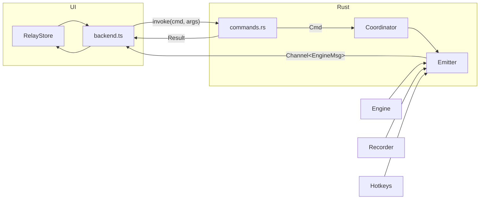
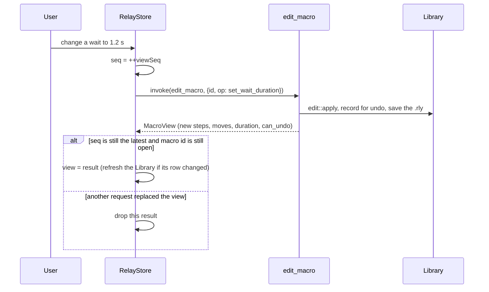
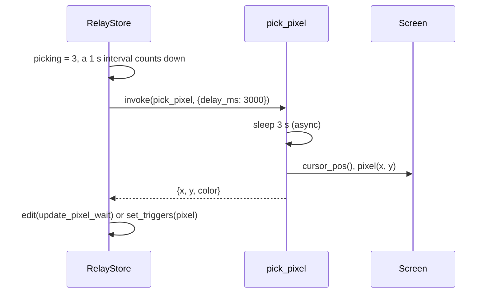

# IPC

The UI and Rust talk in two directions:

- **UI → Rust:** Tauri commands (`invoke`), request and response. They ask for data or an action.
- **Rust → UI:** one ordered stream, `Channel<EngineMsg>`, for everything the session does on its own schedule.



- [Commands](#commands)
- [The session stream](#the-session-stream)
- [Errors](#errors)
- [Sequences](#sequences)
- [Generated bindings](#generated-bindings)
- [Adding a command](#adding-a-command)

## Commands

All commands are in [`src-tauri/src/commands.rs`](../../src-tauri/src/commands.rs), and all are wrapped by [`src/lib/ipc/backend.ts`](../../src/lib/ipc/backend.ts), which is the only place the UI calls `invoke`. Commands that write files are `#[tauri::command(async)]`, off the main thread; the others are quick and run on it.

### Session

Session commands only send a `Cmd` to the coordinator and return right away. The result comes back on the stream.

| Command | Args | Does |
| --- | --- | --- |
| `subscribe_engine` | `channel: Channel<EngineMsg>` | Sets the stream's receiver. Called once at startup, and again if the UI reloads (the new one replaces the old one). |
| `toggle_record` | | F9 |
| `toggle_play` | `from: f64` | Play or pause from the UI's playhead |
| `stop_session` | | Stop, like Esc |
| `seek` | `t: f64` | Moves the engine while playing, or remembers the idle playhead for F10 |

### Macros

| Command | Args | Returns |
| --- | --- | --- |
| `list_macros` | | `MacroListItem[]` |
| `load_macro` | `id` | `MacroView`, and tells the coordinator it's selected |
| `edit_macro` | `id, op: EditOp` | The new `MacroView`. Records the edit for undo. |
| `undo_edit` | `id, redo: bool` | The `MacroView` after undoing (or redoing) the last edit |
| `set_playback_options` | `id, options: PlaybackOptions` | The new `MacroView`. A speed change also goes to a running engine. |
| `duplicate_macro` | `id` | The copy's id |
| `delete_macro` | `id` | Refused with `busy` while a session runs |
| `restore_macro` | `id` | |
| `export_macro` | `id, format, path` | Writes the file |
| `import_macros` | `paths: string[]` | `ImportResult { imported: id[], problems: string[] }` |

Save and open dialogs are shown by the UI with `@tauri-apps/plugin-dialog`, and the chosen paths are passed to `export_macro` and `import_macros`.

### Screen

| Command | Args | Returns |
| --- | --- | --- |
| `sample_pixel` | `x, y` | `"#RRGGBB"` or `null` |
| `pick_pixel` | `delay_ms` | `PickedPixel { x, y, color }` under the real cursor after the delay (async, doesn't block the IPC thread) |

### Triggers

| Command | Args | Returns |
| --- | --- | --- |
| `get_triggers` | `id` | `TriggerStatus { triggers, next_run, hotkey_error, paused }` |
| `set_triggers` | `id, triggers: MacroTriggers` | `TriggerStatus`. Refuses a hotkey that clashes with Relay's or another macro's (`code: "hotkey"`). Re-registers hotkeys synchronously when idle, so `hotkey_error` in the response is already current. |
| `set_triggers_paused` | `paused` | |
| `list_processes` | | Running executable names, for suggestions |

### Settings and window

| Command | Args | Returns |
| --- | --- | --- |
| `get_settings`, `update_settings` | `settings` | `Settings` |
| `get_autostart`, `set_autostart` | `enabled` | `bool` |
| `fit_window` | `width, height, expanded` | Resizes and re-places the window around its bottom-center anchor |
| `window_prefs` | | `{ expanded }`, read before the first render |
| `hide_to_tray` | | Hides, or quits if *Close to tray* is off |
| `quit` | | |

## The session stream

[`ipc.rs`](../../src-tauri/src/ipc.rs): `EngineMsg` is a tagged enum (`{"type": "play_tick", …}`), sent through the `Emitter`, which holds the current `Channel`. A Tauri `Channel` preserves order and is much faster than events for high-frequency messages.

| Message | Sent by | When | Payload |
| --- | --- | --- | --- |
| `session` | Coordinator | Every mode change | `mode`, `macro_id` |
| `countdown` | Coordinator | Every 50 ms | `left_ms` |
| `rec_progress` | Recorder thread | Every 100 ms | `elapsed_ms`, `desktop`, new `moves`, `steps` when they changed |
| `play_tick` | Engine | Every 33 ms, and right after any command | `t`, `advancing`, `speed`, `loop_idx`, `loops` |
| `finished` | Coordinator | Playback ended, once per playback | `reason`, `timing` (p50, p99, max lateness) |
| `saved` | Coordinator | A recording was saved | `id` |
| `library_changed` | Coordinator | A run was counted, a recording saved | |
| `toggle_compact` | Hotkey handler | Ctrl+Shift+M | |
| `triggers_paused` | Coordinator | Paused or resumed | `paused` |
| `notice` | Anyone | Information: elevated target, busy skip, hook restarted, pixel timeout | `message` |
| `error` | Anyone | Something failed | `message` |

`FinishReason` is one of `completed`, `stopped`, `key_pressed`, `killed`, `pixel_timeout`, `error`. The UI rewinds the playhead for every reason except `completed` and `pixel_timeout`.

### Why the UI extrapolates

30 ticks a second is enough to be exact, but not enough to look smooth at 60 or 120 Hz. The store keeps the last tick `{ t, at, speed, advancing }` and, on every animation frame:

```ts
cur = tick.t + Math.min(now - tick.at, 100) * tick.speed;
```

The cap of 100 ms means that if ticks stop arriving (a pixel check froze the engine, the engine is busy), the playhead stops too instead of running ahead. Ticks are the truth: each one snaps `cur` back to the engine's time.

## Errors

Commands return `Result<T, IpcError>`, and `IpcError` serializes as `{ code, message }`. A save that fails after an edit is not an error of the command: the edit is kept, the command returns the new state, and an `error` message tells the user it wasn't saved.

| Code | From |
| --- | --- |
| `not_found` | Unknown macro id |
| `io` | A file couldn't be written |
| `edit_rejected` | `EditError`: no such step, wrong kind of step |
| `busy` | Deleting while a session runs |
| `hotkey` | `set_triggers` with a clashing hotkey |
| `unavailable` | The screen couldn't be read |
| `autostart` | The Run key couldn't be changed |
| `format` | A macro file couldn't be read: *not a Relay macro*, *saved by a newer Relay*, … |

The store shows every error as a toast. Messages are written for users, since that's where they end up.

## Sequences

### Editing a step



Every `MacroView` carries `can_undo` and `can_redo`, which enable the header's Undo and Redo buttons.

The sequence number makes out-of-order responses harmless. Renames are debounced by 250 ms, and a pending name is kept over any `MacroView` that arrives in the meantime, so typing is never overwritten.

### Picking a pixel



## Generated bindings

Every Rust type that crosses the boundary derives `ts_rs::TS` with `#[ts(export)]`. Running `cargo test` writes one `.ts` file per type into [`src/lib/ipc/bindings/`](../../src/lib/ipc/bindings), set by `TS_RS_EXPORT_DIR` in [`.cargo/config.toml`](../../.cargo/config.toml). `src/lib/types.ts` re-exports them with a few UI-side helpers.

The same `cargo test` run also regenerates `src/lib/dev/sample-views.json`, the sample macros as `MacroView`s, for the browser preview.

Both are committed. CI runs `cargo test` and then `git diff --exit-code` on them, so **a Rust type change without regenerated bindings fails the build**.

## Adding a command

1. Write the function in `commands.rs` with `#[tauri::command]`, returning `Result<T>` (the module's alias for `Result<T, IpcError>`) if it can fail.
2. Add it to `generate_handler![…]` in `lib.rs`.
3. Derive `Serialize` and `TS` (with `#[ts(export)]`) on any new argument or return type, and run `cargo test` to generate its binding.
4. Add it to the `Backend` interface in `backend.ts`, with a Tauri implementation and a browser implementation (a simulation, or a rejection with `code: "unavailable"`).
5. Call it from the store, never from a component.

---

<p align="center"><a href="app.md">← The app</a> · <a href="README.md">Contents</a> · <a href="frontend.md">The frontend →</a></p>
