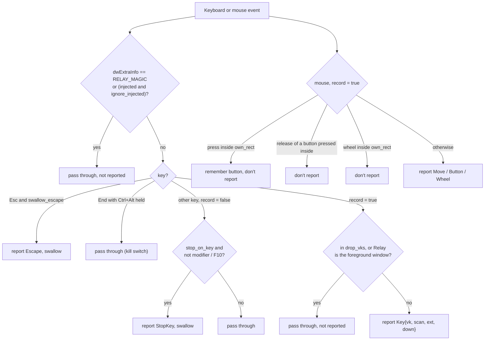

# relay-platform

`crates/relay-platform` is the boundary between Relay and the operating system. It defines traits for everything OS-specific, implements them for Windows in `src/windows/`, and provides a stub for other systems so the rest of the workspace still builds and tests there.

- [The traits](#the-traits)
- [Low-level input hooks](#low-level-input-hooks)
- [Injection](#injection)
- [The precision timer](#the-precision-timer)
- [Screen](#screen)
- [Windows and focus](#windows-and-focus)
- [Character translation](#character-translation)
- [The key map](#the-key-map)
- [The recorder](#the-recorder)
- [Processes](#processes)
- [The stub backend](#the-stub-backend)
- [Adding a backend](#adding-a-backend)

## The traits

```rust
pub struct Platform {
    pub hook: Box<dyn InputHook>,
    pub screen: Arc<dyn Screen>,
    pub windows: Arc<dyn WindowQuery>,
    pub translator: fn() -> Box<dyn CharTranslator>,
    pub injector: fn() -> Box<dyn Injector>,
    pub timer: fn() -> Box<dyn Timer>,      // also raises the calling thread's priority
    pub now_ms: fn() -> f64,                // monotonic ms, the time base of RawInput
}

pub fn platform() -> Platform              // the backend for the current OS
```

| Trait | Methods | Windows implementation |
| --- | --- | --- |
| `InputHook` / `HookSession` | `start(HookConfig, Sender<RawInput>)`, `update(cfg)`, `stop()` | `WH_KEYBOARD_LL` + `WH_MOUSE_LL` on a dedicated thread |
| `Injector` | `move_to`, `button`, `wheel`, `key` | `SendInput` |
| `Timer` | `now_ms`, `wait_until(deadline)`, `waker()` | High-resolution waitable timer + spin |
| `Screen` | `monitors`, `virtual_desktop`, `cursor_pos`, `double_click`, `pixel` | `EnumDisplayMonitors`, `GetDpiForMonitor`, `GetPixel` |
| `WindowQuery` | `root_window_at`, `foreground`, `restore_previous`, `find_window`, `is_elevated`, `self_elevated`, `input_desktop_available` | Win32 windowing, DWM and token APIs |
| `CharTranslator` | `translate(vk, scan, held)` | `ToUnicodeEx` |

Injectors, translators and timers are created by factory functions (`fn() -> Box<dyn …>`) because they're used on the thread that creates them: the timer raises *its* thread's priority, for instance.

`now_ms` is `QueryPerformanceCounter` converted to milliseconds. Every timestamp in Relay, from hook callbacks to engine deadlines, uses this one monotonic clock.

## Low-level input hooks

[`windows/hook.rs`](../../crates/relay-platform/src/windows/hook.rs)

Windows calls low-level hook procedures on the message loop of the thread that installed them, and **silently removes a hook that takes too long** (the `LowLevelHooksTimeout`, around 300 ms to 1 s). So:

- `start` spawns a `relay-hook` thread that installs both hooks, reports success or failure back, and pumps messages until it receives `WM_QUIT` from `stop`.
- The callbacks **only filter, timestamp and `try_send`** to a bounded channel. No allocation, no locks, no logging. If the channel is full, the event is dropped rather than blocking Windows' input queue.
- The filter settings live in an `ArcSwap<HookConfig>`, so `update` can change them without a lock.

What the callbacks do with each event:



| `HookConfig` field | Recording | Playback |
| --- | --- | --- |
| `record` | `true` | `false`: nothing is reported except Esc and stop keys |
| `own_rect`, `own_window` | Relay's window, to drop UI clicks and keys | The same |
| `swallow_escape` | `true` | `true` |
| `ignore_injected` | From settings (default `true`) | The same |
| `drop_vks` | `[F9]` | `[F10]` |
| `stop_on_key` | `false` | From the macro |

Two details that took debugging:

- **Relay's own input** is tagged with `RELAY_MAGIC` (`0x52454C59`, "RELY") in `dwExtraInfo`, so it's recognized even when *Ignore simulated input* is off.
- **The kill switch** is checked with `GetAsyncKeyState` for Ctrl and Alt. It passes through even with *Stop on key press*, which would otherwise swallow the End key as an ordinary stop.

The hook can still disappear under load. The app detects that with a [watchdog](app.md#the-recorder-thread-and-the-hook-watchdog).

## Injection

[`windows/inject.rs`](../../crates/relay-platform/src/windows/inject.rs)

Every `INPUT` carries `RELAY_MAGIC` in `dwExtraInfo`.

- **`move_to(x, y)`** sends an absolute move with `MOUSEEVENTF_VIRTUALDESK`, normalizing to 0–65535 across the virtual desktop. Normalization can land one pixel off at some scalings, so it reads the cursor back and corrects with `SetCursorPos` when needed.
- **`button` and `wheel`** send at the current position. The engine always moves first.
- **`key(key, down, ch)`** picks the most faithful representation available:

| Known | Sent as | Why |
| --- | --- | --- |
| `scan != 0` | `KEYEVENTF_SCANCODE` (+ `EXTENDEDKEY`) | The physical key, which games and DirectInput apps expect, and which types what it typed during recording on the same layout |
| `vk != 0` | Virtual key | Input that was itself injected (no scan code) still types the right character on the current layout |
| `code` only | `keymap::scan_for_code` | Hand-written or migrated macros |
| `ch` only | `KEYEVENTF_UNICODE`, per UTF-16 unit | Last resort: types the text |

`SendInput` returns how many events it inserted. Fewer than requested almost always means **UIPI**: the target runs at a higher integrity level (as administrator). The error says so, and the engine reports it once per playback.

## The precision timer

[`windows/timer.rs`](../../crates/relay-platform/src/windows/timer.rs)

`std::thread::sleep` on Windows has 1 to 15 ms of slack, which is visible in fast macros. The playback timer:

1. **Sleeps** on a waitable timer created with `CREATE_WAITABLE_TIMER_HIGH_RESOLUTION` until 1 ms before the deadline (falling back to a normal waitable timer on older Windows).
2. **Spins** for the last millisecond, checking the waker event.
3. Waits on the timer **and** a wake event with `WaitForMultipleObjects`, so a pause, seek or stop from the coordinator interrupts it immediately. `wait_until` returns `true` when woken early.

Creating it also sets `THREAD_PRIORITY_HIGHEST` on the engine thread and opts the process out of **power throttling** (`PROCESS_POWER_THROTTLING_EXECUTION_SPEED` and `IGNORE_TIMER_RESOLUTION`). Windows 11 otherwise coarsens the timers of background processes, and Relay is usually in the background while it plays.

Measured over a 10-minute release-build soak, 12,000 events: median and p99 lateness under 0.01 ms, worst case about 1 ms.

## Screen

[`windows/screen.rs`](../../crates/relay-platform/src/windows/screen.rs)

- **Monitors**: `EnumDisplayMonitors` + `GetMonitorInfoW` (bounds, work area, primary flag, device name) + `GetDpiForMonitor` (effective DPI).
- **Virtual desktop**: `SM_XVIRTUALSCREEN` … `SM_CYVIRTUALSCREEN`.
- **Double-click settings**: `GetDoubleClickTime` and `SM_CXDOUBLECLK`/`SM_CYDOUBLECLK`, stored with each recording for step grouping.
- **Pixel**: `GetPixel` on the screen DC. That's a few microseconds per sample, which is plenty for pixel checks every 30 ms and triggers every 250 ms.

The app is **per-monitor DPI aware (v2)** through `src-tauri/app.manifest`. Every coordinate in Relay, recorded or injected, is a physical pixel, so display scaling never distorts a macro.

## Windows and focus

[`windows/window.rs`](../../crates/relay-platform/src/windows/window.rs)

| Method | How |
| --- | --- |
| `root_window_at(x, y)` | `WindowFromPoint` → `GetAncestor(GA_ROOT)`. The rect is the visible frame from `DWMWA_EXTENDED_FRAME_BOUNDS` (`GetWindowRect` includes invisible resize borders). Returns the exe name, class, title and rect. Used for the anchor window. |
| `foreground()` | `GetForegroundWindow` + owning process id |
| `restore_previous(own)` | A `SetWinEventHook(EVENT_SYSTEM_FOREGROUND)` thread records the last foreground window of **another** process. If it's gone, the first real window below Relay in z-order (visible, not minimized, not a tool window, not cloaked on another virtual desktop). Then `SetForegroundWindow`. |
| `find_window(exe, class)` | `EnumWindows` for the topmost visible window of that exe and class. Used by *Window* coordinates. |
| `is_elevated(pid)`, `self_elevated()` | `OpenProcessToken` + `TokenElevation` |
| `input_desktop_available()` | `OpenInputDesktop` fails on the secure desktop (lock screen, UAC prompt) |

Process names come from `QueryFullProcessImageNameW`, so they work without admin rights for most processes.

## Character translation

[`windows/text.rs`](../../crates/relay-platform/src/windows/text.rs)

The recorder wants to know what character each key press typed, to build `TYPE` steps and show text. `ToUnicodeTranslator` calls `ToUnicodeEx` with:

- a keyboard state built from the keys the recorder saw held (adding the generic Shift, Ctrl and Alt that low-level hooks don't report, and Caps Lock from `GetKeyState`),
- the **foreground window's** keyboard layout, since layouts are per thread,
- flag `0x4` (don't change keyboard state, Windows 10 1607+). Without it, translating a dead key such as `^` on AZERTY would consume it, and the user's next character would come out wrong in the app they're typing into.

A negative result is a dead key, which types nothing by itself.

## The key map

[`keymap.rs`](../../crates/relay-platform/src/keymap.rs) (OS-independent)

- `code(scan, ext, vk)` maps a set-1 scan code (as Windows reports it) to a W3C `code`, falling back to the virtual key for keys without a known scan code (media keys, injected input).
- `scan_for_code(code)` goes back, for replaying keys that were stored without a scan code.

## The recorder

[`recorder.rs`](../../crates/relay-platform/src/recorder.rs) (OS-independent)

`Recorder` turns `RawInput`s into `Event`s. Character translation is injected, so it's tested with synthetic input and a fake US translator.

- **Time**: raw QPC milliseconds minus the recording start, rounded to `Ms`.
- **Moves**: dropped when unchanged, and throttled to one per `move_interval_ms` (16 ms), or ignored entirely without *Capture mouse path*.
- **Keys**: dropped without *Capture keystrokes*. End with Ctrl and Alt held (the kill switch) is dropped. Each down gets its character from the translator.
- **First press**: the position of the first button down, to find the anchor window.
- **`take_new_moves`** returns the cursor samples since the last call, for live progress.
- **`finish`**: trims modifier presses after the last real action (the Ctrl and Alt of the kill switch that stopped it), then `normalize`.
- **`is_meaningful(events)`**: at least one non-move event, or at least 5 moves. Otherwise the recording is discarded.

## Processes

[`processes.rs`](../../crates/relay-platform/src/processes.rs)

`ProcessWatcher` wraps [`sysinfo`](https://crates.io/crates/sysinfo) and returns the lowercase names of running executables, refreshing only process names. It's cross-platform. On Linux, process names are truncated to 15 characters, which the tests account for.

## The stub backend

[`stub.rs`](../../crates/relay-platform/src/stub.rs) is compiled on every non-Windows target. Hooks and injection return `PlatformError::Unsupported`, the screen reports a 1920×1080 virtual desktop, and the timer uses `std::thread::sleep`. It exists so `relay-core` and `relay-platform` build, lint and test on Linux CI.

## Adding a backend

A macOS or Linux backend is a new module next to `windows/`, selected with `#[cfg]` in `platform()`:

| Trait | macOS | Linux (X11) | Linux (Wayland) |
| --- | --- | --- | --- |
| `InputHook` | `CGEventTap` (Accessibility permission) | XRecord | No global capture by design; needs a portal or root `evdev` |
| `Injector` | `CGEventPost` | XTest | `uinput` |
| `Screen::pixel` | `CGWindowListCreateImage` | `XGetImage` | Screenshot portal |
| `WindowQuery` | `NSWorkspace`, `CGWindowListCopyWindowInfo` | EWMH | Compositor-specific |

The recorder, key map, step grouping and everything above don't change.

---

<p align="center"><a href="core.md">← relay-core</a> · <a href="README.md">Contents</a> · <a href="app.md">The app →</a></p>
