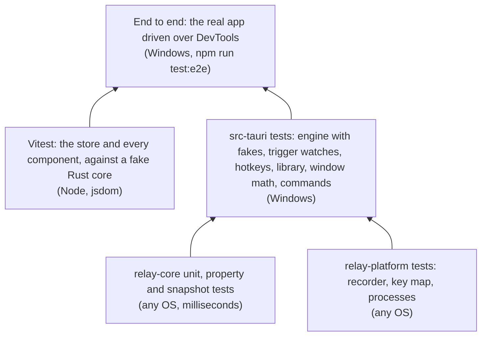

# Testing and CI

Relay is tested in layers. The pure logic is tested hardest, because it's where most of the behavior is and where tests are cheapest. The OS layer is kept thin and checked end to end against the real app.



| Layer | Tests | Where |
| --- | --- | --- |
| Rust unit, property and snapshot tests | about 180 | Next to the code, in `#[cfg(test)]` modules |
| Frontend: the store, the backend contract and the components | about 390 | `src/**/*.test.ts` |
| End to end, against the built app | 77 | [`e2e/`](../../e2e) |

- [Running the tests](#running-the-tests)
- [relay-core](#relay-core)
- [relay-platform](#relay-platform)
- [The app](#the-app)
- [The frontend](#the-frontend)
- [End-to-end testing](#end-to-end-testing)
- [Manual checks before a release](#manual-checks-before-a-release)
- [CI](#ci)
- [Releases](#releases)

## Running the tests

```bash
cargo test --workspace     # all Rust tests; also regenerates the TS bindings and the browser fixture
cargo test -p relay-core   # just the core (fast)
cargo fmt --all            # 120 columns, see rustfmt.toml; CI checks it
cargo clippy --workspace --all-targets -- -D warnings
npm test                   # Vitest
npm run test:coverage      # Vitest with coverage (coverage/index.html)
npm run check              # svelte-check (types and accessibility)
npm run test:e2e           # the real app, end to end (build it first, see below)
cargo llvm-cov --workspace --summary-only   # Rust coverage, with cargo-llvm-cov
```

Set `PROPTEST_CASES=2000` for a longer property-test run than the default.

## relay-core

88 tests, all pure, so they also run on Linux.

| Area | What's tested |
| --- | --- |
| `steps` | Click vs. drag at the slop boundary, double and triple clicks by time and distance, scroll merging and direction changes, typing gaps, Ctrl combos vs. AltGr text, modifier ownership, auto-repeat |
| `edit` | Each `EditOp`, inserting after the step under the playhead and never inside one, deleting a wait closes the gap, retiming a pause and trimming pauses, `normalize` on orphan releases and unreleased presses |
| `format` | Round trips, `NotRelay` and `TooNew`, the v0 migration |
| `playback` | The clock under speed changes, pause, seek and loops. Humanize stays within bounds, keeps whole steps together and keeps order. |
| `session` | Every transition and its effects, including the ignored inputs |
| `schedule` | Next run across days and weeks, and both DST transitions |
| `triggers` | `PixelEdge` and `ProcessLaunchEdge` sequences, defaults for partial JSON |

### Property tests

[`proptests.rs`](../../crates/relay-core/src/proptests.rs) uses [proptest](https://crates.io/crates/proptest) to generate random recordings (clicks, drags, double clicks, scrolls, typing, combos, held modifiers, random gaps) and random sequences of edits, and checks:

| Property | Meaning |
| --- | --- |
| `recordings_satisfy_the_invariants` | Any generated recording, normalized, is sorted, balanced and has nothing inside waits |
| `steps_own_disjoint_valid_events` | Every step's items are valid indices, and no event belongs to two steps |
| `edits_preserve_the_invariants` | Any sequence of inserts, deletes, duration, pause and label changes and pause trimming keeps the invariants |
| `deleting_every_step_leaves_only_moves` | Deleting steps until none are left leaves only cursor moves |

When proptest finds a failure, it shrinks it to a minimal case and saves it in `proptest-regressions/`. Commit that file, so the case is retried forever.

### Snapshots

[insta](https://insta.rs) snapshots in [`src/snapshots/`](../../crates/relay-core/src/snapshots) pin the exact `.rly` output of a fixed macro and the result of migrating an M0 export. A format change shows up as a snapshot diff in review. Accept intended changes with `cargo insta review`, or by replacing the `.snap` file.

## relay-platform

- **Recorder**: synthetic `RawInput` sequences with a fake US translator. Covers a click, typing and Ctrl+S grouped into the right steps, physical key codes, *Capture keystrokes* off, the kill switch (and its modifiers) left out, live moves reported once, and `is_meaningful`.
- **Key map**: scan code ↔ W3C code round trips.
- **Processes**: sees the test's own process (by prefix, since Linux truncates names to 15 characters).

## The app

`src-tauri` tests run on Windows:

| Module | What's tested |
| --- | --- |
| `engine` | With a fake clock, a recording injector and a fake screen: injection on schedule and lateness stats, speed, pause/seek/speed changes, loops releasing between loops, releasing a button when dropped mid-drag, pixel checks waiting, timing out with their step number, and pausing during a check, and the window offset |
| `history` | Undo and redo, a new edit clearing redo, typed renames as one step |
| `hotkeys` | Parsing UI combos (spacing, order, F1–F24 alone), which hotkeys each session state registers, recognizing Relay's own, conflicts with other macros' hotkeys (written either way; disabled ones don't count) |
| `library` | Seeding on first run, persistence, duplicate/trash/restore/import, triggers and the pre-trigger hotkey migration, broken files reported without failing |
| `settings` | Persistence and partial files |
| `rec_thread` | The watchdog: fires on silent movement, respects the cooldown, never fires on a still cursor |
| `triggers` | `ScheduleWatch` (on time, a few seconds late, skipped after sleep, days, shared times), `LaunchWatch` (lower-case names, the baseline, once per start, triggers switched off) and `PixelWatch` (two samples, tolerance, unreadable screens, a moved pixel) |
| `window_ctl` | Zoom on small screens and high scaling; the layout (default spot, bottom-center anchor, kept inside the work area, negative coordinates, centering); which monitor owns an anchor; `window.json` round trips and bad files |
| `commands` | Error codes for the UI, exports that import again, an import with broken and missing files |
| `coordinator` | Click-through detection under the widget, with the window offset |
| `ipc`, `storage` | The message stream's JSON shape and resubscribing; atomic writes |

Each trigger thread only sleeps and feeds a `*Watch` type the time, the running programs or a pixel reader, so what fires when is tested without threads.

The engine is the best example of the approach: `Engine::advance(now)` takes time as an argument and gets its injector and pixel reader injected, so a test can say "at t = 1000, the button must be down" without threads or sleeps.

## The frontend

[Vitest](https://vitest.dev) runs in jsdom with [Testing Library](https://testing-library.com/docs/svelte-testing-library/intro). The pure modules in `src/lib/` have their own tests: formatting, lanes, geometry and hotkey capture. Everything else runs against a **fake Rust core**:

- [`src/test/fake-core.ts`](../../src/test/fake-core.ts) sits behind Tauri's own IPC mock (`@tauri-apps/api/mocks`). The UI runs its real `tauriBackend`, and every `invoke` lands in the fake. The fake holds the sample library in memory, applies edits roughly the way relay-core does, and records every call (`core.calls`, `core.argsOf("edit_macro")`). A test can make a command fail (`core.fail`), answer it differently (`core.on`), or hold its response until the test releases it (`core.hold`, `core.held`). `core.emit(msg)` delivers an engine message the way the coordinator does.
- [`src/test/app.ts`](../../src/test/app.ts) gives each test a fresh store with `freshStore()`, which uses `resetRelay()` (components read the `relay` binding live). `settle()` lets responses and Svelte updates run.

| Tests | What's covered |
| --- | --- |
| [`backend.test.ts`](../../src/lib/ipc/backend.test.ts) | Every `Backend` method sends one command with the argument names Rust expects; the export and import dialogs, including cancelling; the browser preview's simulation (countdown, loops, pause, seek, speed, forever) |
| [`relay.test.ts`](../../src/lib/state/relay.test.ts) | The store: startup, every engine message, each action and its guards (busy sessions, nothing open), dropping responses for a macro the user left, rename debouncing, undo and redo, Pick's countdown, toasts, keyboard shortcuts in the app and the browser |
| `src/components/**/*.test.ts` | Every button, switch, radio and field in every component, checked by the command it sends: the header, the transport, each tab, the step editor, the preview and timeline (including seeking by pointer), the compact player, the export dialog, the app shell and the demo desktop |

jsdom has no layout, so tests that seek by pointer stub `getBoundingClientRect`. [`src/test/setup.ts`](../../src/test/setup.ts) fills in what jsdom lacks: `<dialog>`, `ResizeObserver` and animation frames.

## End-to-end testing

Some things only show up in the real app: the coordinator and its threads, the engine's timing, files on disk, the native window, triggers firing. [`e2e/`](../../e2e) drives the built app through the Chrome DevTools Protocol, which WebView2 exposes with a command-line flag:

```bash
npx tauri build --debug --no-bundle
npm run test:e2e
```

The build puts the app, with the UI built in, at `target/debug/relay.exe`. Quit Relay before running the tests: only one copy runs at a time, so the tests would reach yours instead (the harness checks for this). Set `RELAY_EXE` to test another build, such as `target/release/relay.exe`.

[`e2e/harness.mjs`](../../e2e/harness.mjs) starts Relay on a scratch data folder (`RELAY_DATA_DIR`), with remote debugging on a random port. It clicks the page's own controls by their accessible names (`page.click("Play")`) and reads the store (`page.store("mode")`). Where the UI would open a native dialog, it calls the command instead (`page.invoke("import_macros", …)`). Then it checks the files Relay writes. `app.restart()` quits and relaunches on the same folder, to check what survives.

The tests never send input to the desktop. Macros that get played contain only waits and pixel checks (`waitingMacro()`). The triggers fire on real events: `ping.exe` launching, a scheduled minute arriving, and, for the pixel trigger, a patch of Relay's own window changing color.

| Suite | What's covered |
| --- | --- |
| `library` | The first run's samples; renaming; duplicate; delete to the trash folder, and Undo; import (`.rly`, `.json`, broken, too new, missing); export in both formats and back; `not_found` for every per-macro command; a restart; damaged macro files and a damaged `library.json` |
| `editing` | Deleting a step; undo and redo (buttons, and Ctrl + Z / Ctrl + Y); + Wait and + Pixel check; the step editor's label, pause, wait duration and every pixel field; Trim pauses; a rejected edit; every playback option; undo history kept per macro, and not across restarts |
| `settings` | Every setting in `settings.json`; Keep on top on the native window, including "only during sessions"; compact mode resizing the window and reopening compact; the anchor kept; close to tray hiding, and quitting when it's off |
| `playback` | Playing to the end, with the run counted; loops; speed; pause and resume; stop; playing from the playhead; seeking and changing speed mid-playback; a pixel check timing out; the busy guard; recording's countdown, and cancelling it |
| `triggers` | Hotkeys registered, and refused for Relay's own, another macro's or an unusable combo; the schedule saved with its next run, then firing at the minute; the app-launch trigger firing, skipped while busy, and not firing while paused; the pixel trigger firing once per change; the log recording each run; everything after a restart |

Anything that needs real input isn't covered end to end: recording actual clicks and keys, Esc, stop on key press, pressing a macro's hotkey, the kill switch, and the tray menu. The engine's injection is covered by its unit tests with a recording injector. The rest is in the manual checks below.

### By hand

The same technique works interactively. Start Relay with a throwaway data folder and remote debugging:

```powershell
$env:RELAY_DATA_DIR = "$env:TEMP\relay-e2e"
$env:WEBVIEW2_ADDITIONAL_BROWSER_ARGUMENTS = "--remote-debugging-port=9333"
.\target\release\relay.exe
```

Then run JavaScript in the page with [`scripts/cdp.mjs`](../../scripts/cdp.mjs):

```powershell
'return window.__relay.library.map(m => m.name)' | Out-File -Encoding utf8 check.js
node scripts/cdp.mjs 9333 check.js
```

In the page, `window.__relay` is the store (state and actions), and `window.__TAURI_INTERNALS__.invoke(cmd, args)` calls any command directly.

Real input for recordings can come from PowerShell (`SendKeys`, `SetCursorPos`, `mouse_event`), but it's *injected*, so set `"ignore_injected": false` in the scratch `settings.json` first. Otherwise Relay ignores it, as designed.

Things learned the hard way:

- Find the widget with `FindWindow("Tauri Window", "Relay")`. The tray icon also owns a window titled "Relay".
- Screenshot the visible frame with `DWMWA_EXTENDED_FRAME_BOUNDS`, not `GetWindowRect`, which includes invisible borders.
- Synthetic DOM events need `{ bubbles: true }` to reach Svelte's delegated handlers.
- Windows PowerShell 5 mangles non-ASCII in scripts. In JavaScript strings, use Unicode escapes (a backslash, `u` and four hex digits) instead of the characters themselves.
- `SendKeys` types characters through the current layout. On AZERTY, digits need Shift, so prefer letters in tests.

[`scripts/docs-screenshots.ps1`](../../scripts/docs-screenshots.ps1) uses the same technique to regenerate every image in `docs/images`.

## Manual checks before a release

What automated tests can't cover well:

- [ ] Record and replay in Notepad, a browser and an Office app, at 100% and 150% scaling, and across two monitors
- [ ] Double clicks, drags (including window drags), scrolls, AltGr characters, dead keys
- [ ] Esc, stop on key press and the kill switch during a long loop, with nothing left pressed afterwards
- [ ] Play from the play button: input goes to the previous app, not Relay
- [ ] An elevated target shows the warning
- [ ] Each trigger type fires once, and is skipped while busy or locked
- [ ] Close to tray, Start with Windows (sign out and in), single instance
- [ ] A 10-minute soak: memory stays flat, timing stats in the log stay under 2 ms p99
- [ ] The installer installs, upgrades and uninstalls cleanly on a fresh Windows 10 and 11

## CI

[`.github/workflows/ci.yml`](../../.github/workflows/ci.yml) runs on pushes to `main`, milestone and fix branches, and on pull requests:

| Job | Steps |
| --- | --- |
| **windows** | `npm ci` → `cargo test --workspace` → **generated files are up to date** (`git diff --exit-code` on the bindings and the browser fixture) → `cargo fmt --check` → `cargo clippy -D warnings` → `npm run check` → `npm test` → `npx tauri build` → upload the installer as an artifact → `npm run test:e2e` against the release build |
| **linux** | `cargo test` and `clippy -D warnings` for `relay-core` and `relay-platform`, which keeps them portable |
| **msrv** | `cargo check --workspace` with Rust 1.95, the `rust-version` in `Cargo.toml` (the highest any dependency needs, from `sysinfo`) |

## Releases

[`.github/workflows/release.yml`](../../.github/workflows/release.yml) runs on version tags `vX.Y.Z` (milestone tags like `v0.8.0-m7` don't match). It runs the tests, builds with [tauri-action](https://github.com/tauri-apps/tauri-action), and attaches the installer and the portable .exe (`target/release/relay.exe`, renamed `Relay_X.Y.Z_x64-portable.exe`) to a **draft** GitHub release, to be reviewed and published by hand.

It can also be run by hand (**Actions → Release → Run workflow**) with an existing tag: it builds that tag and adds (or replaces) its portable .exe on the release. That's how releases made before the portable .exe existed got theirs.

To release:

1. Bump the version in `Cargo.toml` (workspace), `package.json` and `src-tauri/tauri.conf.json`.
2. Add the release to `CHANGELOG.md`.
3. Merge to `main`, tag `vX.Y.Z` and push the tag.
4. Check the draft release, then publish it.

---

<p align="center"><a href="file-formats.md">← File formats</a> · <a href="README.md">Contents</a> · <a href="../../CONTRIBUTING.md">Contributing →</a></p>
