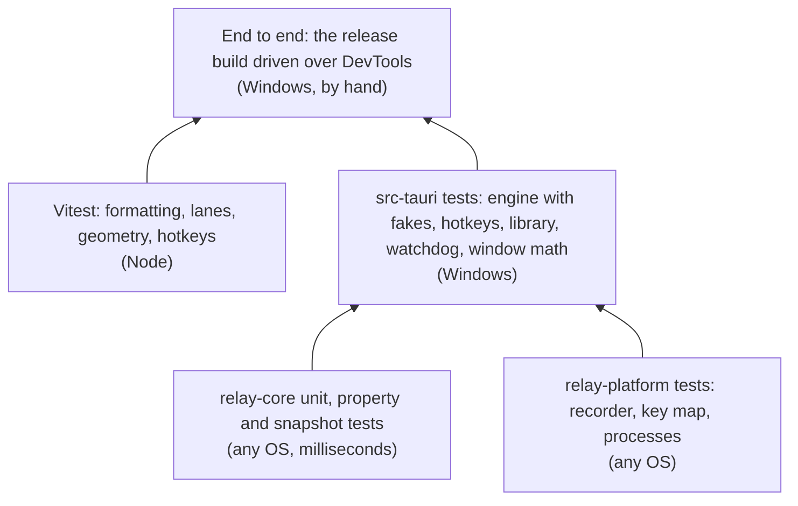

# Testing and CI

Relay is tested in layers. The pure logic is tested hardest, because it's where most of the behavior is and where tests are cheapest. The OS layer is kept thin and checked end to end against the real app.



- [Running the tests](#running-the-tests)
- [relay-core](#relay-core)
- [relay-platform](#relay-platform)
- [The app](#the-app)
- [The frontend](#the-frontend)
- [End-to-end testing](#end-to-end-testing)
- [Manual checks before a release](#manual-checks-before-a-release)
- [CI](#ci)
- [Releases](#releases)

## Running the tests

```bash
cargo test --workspace     # all Rust tests; also regenerates the TS bindings and the browser fixture
cargo test -p relay-core   # just the core (fast)
cargo fmt --all            # 120 columns, see rustfmt.toml; CI checks it
cargo clippy --workspace --all-targets -- -D warnings
npm test                   # Vitest
npm run check              # svelte-check (types and accessibility)
```

Set `PROPTEST_CASES=2000` for a longer property-test run than the default.

## relay-core

88 tests, all pure, so they also run on Linux.

| Area | What's tested |
| --- | --- |
| `steps` | Click vs. drag at the slop boundary, double and triple clicks by time and distance, scroll merging and direction changes, typing gaps, Ctrl combos vs. AltGr text, modifier ownership, auto-repeat |
| `edit` | Each `EditOp`, inserting after the step under the playhead and never inside one, deleting a wait closes the gap, retiming a pause and trimming pauses, `normalize` on orphan releases and unreleased presses |
| `format` | Round trips, `NotRelay` and `TooNew`, the v0 migration |
| `playback` | The clock under speed changes, pause, seek and loops. Humanize stays within bounds, keeps whole steps together and keeps order. |
| `session` | Every transition and its effects, including the ignored inputs |
| `schedule` | Next run across days and weeks, and both DST transitions |
| `triggers` | `PixelEdge` and `ProcessLaunchEdge` sequences, defaults for partial JSON |

### Property tests

[`proptests.rs`](../../crates/relay-core/src/proptests.rs) uses [proptest](https://crates.io/crates/proptest) to generate random recordings (clicks, drags, double clicks, scrolls, typing, combos, held modifiers, random gaps) and random sequences of edits, and checks:

| Property | Meaning |
| --- | --- |
| `recordings_satisfy_the_invariants` | Any generated recording, normalized, is sorted, balanced and has nothing inside waits |
| `steps_own_disjoint_valid_events` | Every step's items are valid indices, and no event belongs to two steps |
| `edits_preserve_the_invariants` | Any sequence of inserts, deletes, duration, pause and label changes and pause trimming keeps the invariants |
| `deleting_every_step_leaves_only_moves` | Deleting steps until none are left leaves only cursor moves |

When proptest finds a failure, it shrinks it to a minimal case and saves it in `proptest-regressions/`. Commit that file, so the case is retried forever.

### Snapshots

[insta](https://insta.rs) snapshots in [`src/snapshots/`](../../crates/relay-core/src/snapshots) pin the exact `.rly` output of a fixed macro and the result of migrating an M0 export. A format change shows up as a snapshot diff in review. Accept intended changes with `cargo insta review`, or by replacing the `.snap` file.

## relay-platform

- **Recorder**: synthetic `RawInput` sequences with a fake US translator. Covers a click, typing and Ctrl+S grouped into the right steps, physical key codes, *Capture keystrokes* off, the kill switch (and its modifiers) left out, live moves reported once, and `is_meaningful`.
- **Key map**: scan code ↔ W3C code round trips.
- **Processes**: sees the test's own process (by prefix, since Linux truncates names to 15 characters).

## The app

`src-tauri` tests run on Windows:

| Module | What's tested |
| --- | --- |
| `engine` | With a fake clock, a recording injector and a fake screen: injection on schedule and lateness stats, speed, pause/seek/speed changes, loops releasing between loops, releasing a button when dropped mid-drag, pixel checks waiting, timing out with their step number, and pausing during a check, and the window offset |
| `history` | Undo and redo, a new edit clearing redo, typed renames as one step |
| `hotkeys` | Parsing UI combos, conflicts with Relay's own and other macros' hotkeys |
| `library` | Seeding on first run, persistence, duplicate/trash/restore/import, triggers and the pre-trigger hotkey migration, broken files reported without failing |
| `settings` | Persistence and partial files |
| `rec_thread` | The watchdog: fires on silent movement, respects the cooldown, never fires on a still cursor |
| `triggers` | Next scheduled run |
| `window_ctl` | Zoom on small screens and high scaling |

The engine is the best example of the approach: `Engine::advance(now)` takes time as an argument and gets its injector and pixel reader injected, so a test can say "at t = 1000, the button must be down" without threads or sleeps.

## The frontend

[Vitest](https://vitest.dev) tests sit next to the modules they test in `src/lib/`: time formatting and "Next run" labels, timeline lanes and step navigation, preview geometry (path lengths, lookups, fitting the view), and hotkey capture from `KeyboardEvent`s.

## End-to-end testing

Some things only show up in the real app: hooks, injection, focus, DPI, WebView2 behavior. They're tested by driving the **release build** through the Chrome DevTools Protocol, which WebView2 exposes with a command-line flag.

1. Build: `npx tauri build`.
2. Start Relay with a throwaway data folder and remote debugging:

   ```powershell
   $env:RELAY_DATA_DIR = "$env:TEMP\relay-e2e"
   $env:WEBVIEW2_ADDITIONAL_BROWSER_ARGUMENTS = "--remote-debugging-port=9333"
   .\target\release\relay.exe
   ```

3. Run JavaScript in the page with [`scripts/cdp.mjs`](../../scripts/cdp.mjs):

   ```powershell
   'return window.__relay.library.map(m => m.name)' | Out-File -Encoding utf8 check.js
   node scripts/cdp.mjs 9333 check.js
   ```

In the page, `window.__relay` is the store (state and actions), and `window.__TAURI_INTERNALS__.invoke(cmd, args)` calls any command directly.

Real input for recordings can come from PowerShell (`SendKeys`, `SetCursorPos`, `mouse_event`), but it's *injected*, so set `"ignore_injected": false` in the scratch `settings.json` first. Otherwise Relay ignores it, as designed.

Things learned the hard way:

- Find the widget with `FindWindow("Tauri Window", "Relay")`. The tray icon also owns a window titled "Relay".
- Screenshot the visible frame with `DWMWA_EXTENDED_FRAME_BOUNDS`, not `GetWindowRect`, which includes invisible borders.
- Synthetic DOM events need `{ bubbles: true }` to reach Svelte's delegated handlers.
- Windows PowerShell 5 mangles non-ASCII in scripts. In JavaScript strings, use Unicode escapes (a backslash, `u` and four hex digits) instead of the characters themselves.
- `SendKeys` types characters through the current layout. On AZERTY, digits need Shift, so prefer letters in tests.

[`scripts/docs-screenshots.ps1`](../../scripts/docs-screenshots.ps1) uses the same technique to regenerate every image in `docs/images`.

## Manual checks before a release

What automated tests can't cover well:

- [ ] Record and replay in Notepad, a browser and an Office app, at 100% and 150% scaling, and across two monitors
- [ ] Double clicks, drags (including window drags), scrolls, AltGr characters, dead keys
- [ ] Esc, stop on key press and the kill switch during a long loop, with nothing left pressed afterwards
- [ ] Play from the play button: input goes to the previous app, not Relay
- [ ] An elevated target shows the warning
- [ ] Each trigger type fires once, and is skipped while busy or locked
- [ ] Close to tray, Start with Windows (sign out and in), single instance
- [ ] A 10-minute soak: memory stays flat, timing stats in the log stay under 2 ms p99
- [ ] The installer installs, upgrades and uninstalls cleanly on a fresh Windows 10 and 11

## CI

[`.github/workflows/ci.yml`](../../.github/workflows/ci.yml) runs on pushes to `main`, milestone and fix branches, and on pull requests:

| Job | Steps |
| --- | --- |
| **windows** | `npm ci` → `cargo test --workspace` → **generated files are up to date** (`git diff --exit-code` on the bindings and the browser fixture) → `cargo fmt --check` → `cargo clippy -D warnings` → `npm run check` → `npm test` → `npx tauri build` → upload the installer as an artifact |
| **linux** | `cargo test` and `clippy -D warnings` for `relay-core` and `relay-platform`, which keeps them portable |
| **msrv** | `cargo check --workspace` with Rust 1.95, the `rust-version` in `Cargo.toml` (the highest any dependency needs, from `sysinfo`) |

## Releases

[`.github/workflows/release.yml`](../../.github/workflows/release.yml) runs on version tags `vX.Y.Z` (milestone tags like `v0.8.0-m7` don't match). It runs the tests, builds with [tauri-action](https://github.com/tauri-apps/tauri-action), and attaches the installer and the portable .exe (`target/release/relay.exe`, renamed `Relay_X.Y.Z_x64-portable.exe`) to a **draft** GitHub release, to be reviewed and published by hand.

It can also be run by hand (**Actions → Release → Run workflow**) with an existing tag: it builds that tag and adds (or replaces) its portable .exe on the release. That's how releases made before the portable .exe existed got theirs.

To release:

1. Bump the version in `Cargo.toml` (workspace), `package.json` and `src-tauri/tauri.conf.json`.
2. Add the release to `CHANGELOG.md`.
3. Merge to `main`, tag `vX.Y.Z` and push the tag.
4. Check the draft release, then publish it.

---

<p align="center"><a href="file-formats.md">← File formats</a> · <a href="README.md">Contents</a> · <a href="../../CONTRIBUTING.md">Contributing →</a></p>
