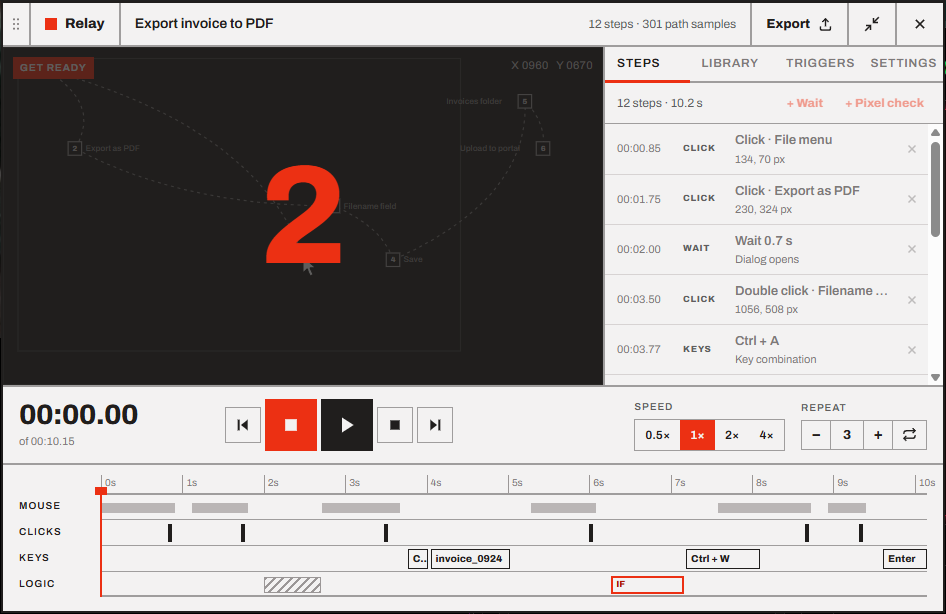

# Getting started

This page takes you from downloading Relay to replaying your first macro.

- [Install](#install)
- [First launch](#first-launch)
- [Your first macro](#your-first-macro)
- [What to read next](#what-to-read-next)

## Install

1. Download **`Relay_1.0.0_x64-setup.exe`** from the [releases page](https://github.com/HappyRave/Relay/releases).
2. Run it. Relay installs for your Windows user only, so it doesn't ask for administrator rights.
3. Start **Relay** from the Start menu.

> [!NOTE]
> The installer isn't code-signed yet, so Windows SmartScreen may show *"Windows protected your PC"*. Click **More info → Run anyway**. The source and the build scripts are all in this repository if you'd like to check what you're running.

**Requirements:** Windows 10 or 11 (64-bit), with the WebView2 runtime. Windows 11 includes it, and the installer adds it on Windows 10 if it's missing.

## First launch

The widget opens centered at the bottom of your main screen. It comes with four **sample macros** from the design ("Export invoice to PDF", "Fill weekly timesheet"…), so you can explore the editor right away.

> [!WARNING]
> The samples were recorded on an imaginary 1920×1080 desktop. **Don't play them on your real desktop**: they would click at those positions in whatever is there. Delete them from the [Library](07-library.md) once you've looked around.

Try this:

- Drag the red playhead along the timeline, and watch the mouse path, the steps and the key overlay follow it.
- Click a step in the list to jump to it.
- Press <kbd>Ctrl</kbd>+<kbd>Shift</kbd>+<kbd>M</kbd> to shrink Relay to the compact player, and again to bring it back.

## Your first macro

We'll record something harmless: typing a line into Notepad.

1. **Open Notepad** and click inside it.
2. **Press <kbd>F9</kbd>.** Relay counts down *3, 2, 1*. Use that time to put your hands back on the mouse and keyboard.

   

3. **Do the task.** Click in Notepad and type `Hello from Relay`, then press <kbd>Enter</kbd>.
4. **Press <kbd>F9</kbd> again** to stop. The recording appears as *Recording 1*, with steps like:

   | Time | Type | Step |
   | --- | --- | --- |
   | 00:00.40 | CLICK | Click · 812, 402 px |
   | 00:01.10 | TYPE | "Hello from Relay" |
   | 00:03.02 | KEYS | Enter |

5. **Press <kbd>F10</kbd>** (or the play button) to replay it. Relay clicks where you clicked and types what you typed, with the same timing.

That's it: recording, then playback. Everything else builds on these two keys.

> [!TIP]
> Give the macro a real name: click *Recording 1* in the header and type, for example, *Say hello*. Names show up in the Library and in notifications.

## What to read next

- Want the macro to wait for something to load? See [Pixel checks](05-pixel-checks.md) and [waits](03-editing.md#waits).
- Want it to run on its own every morning? See [Triggers](06-triggers.md).
- Something didn't replay as expected? See [Troubleshooting](09-troubleshooting.md).

---

<a href="README.md">← User guide</a> · <a href="README.md">Contents</a> · <a href="02-recording.md">Recording →</a>

