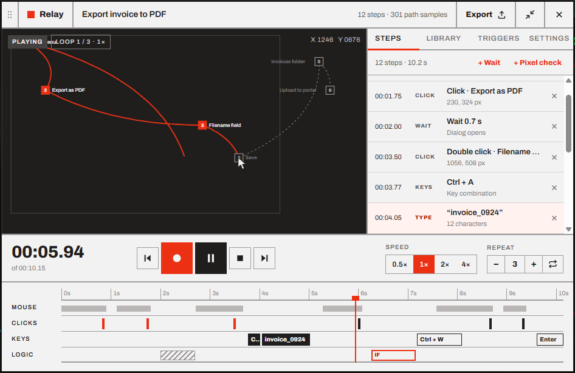

# Playing back

Playback replays a macro's clicks, keys and mouse path with the timing you recorded, or faster, slower, looped or slightly randomized.

- [Play, pause and stop](#play-pause-and-stop)
- [Speed and repeat](#speed-and-repeat)
- [Humanize](#humanize)
- [Stop on key press](#stop-on-key-press)
- [Screen or Window coordinates](#screen-or-window-coordinates)
- [Where the input goes](#where-the-input-goes)
- [The kill switch](#the-kill-switch)
- [The compact player](#the-compact-player)

> [!NOTE]
> Playback options (speed, repeat, Humanize, Stop on key press and Coordinates) are **saved with each macro**, in its file. The *Playback* section of the Settings tab edits the macro that's open.

## Play, pause and stop

| To… | Do |
| --- | --- |
| Play from the playhead | <kbd>F10</kbd> or the **play** button |
| Pause and resume | <kbd>F10</kbd> or the **play/pause** button |
| Stop | <kbd>Esc</kbd>, the **stop** button, or **Stop** in the tray menu |
| Replay part of a macro | Move the playhead (click a step or the timeline), then play |
| Jump while playing | Click the timeline or a step. Playback continues from there. |

Playback starts **wherever the playhead is**. If it's at the end, playback starts from the beginning.

While playing, the preview shows a **Playing** (or **Paused**) badge with the loop and the speed, for example *Loop 1 / 3 · 1×*.

When playback ends:

- **It finished:** the playhead stays at the end, and the macro's run count and *last run* in the Library go up.
- **You stopped it** (<kbd>Esc</kbd>, stop, a key press, the kill switch): the playhead goes back to the start, ready for the next run.
- **A pixel check timed out:** the playhead stays on that step, so you can see where it got stuck. See [Pixel checks](05-pixel-checks.md#when-the-pixel-never-matches).

Relay never leaves a key or mouse button stuck. Anything the macro is holding down is released when playback stops, at the end of each loop and when you jump to another point.

## Speed and repeat

These are in the transport bar, and **each macro remembers its own**.

| Control | Options |
| --- | --- |
| **Speed** | **0.5×**, **1×**, **2×**, **4×**. You can change it while the macro is playing. |
| **Repeat** | **−** and **+** set how many times the macro runs in a row (1 to 99). **∞** loops until you stop it. |

> [!CAUTION]
> Faster isn't always better. At 2× or 4× the apps you're automating get half or a quarter of the time they had when you recorded. If they can't keep up, clicks land before a window is ready. Use [pixel checks](05-pixel-checks.md) to make fast playback reliable.

## Humanize

**Settings → Playback → Humanize** shifts each step by a small random amount, so a long-running loop doesn't click with robot-perfect regularity.

- The slider sets the range, from **±0** to **±200 ms** (default **±40 ms**).
- A step moves as a whole: a click's press and release move together, and steps never swap order.
- Each loop gets a new random pattern.
- It's **on by default**. Turn it off to replay your recording exactly.

## Stop on key press

**Settings → Playback → Stop on key press** (on by default) stops playback **the moment you press any key**. It's a safety net: if the macro goes wrong, just hit a key.

- The key is swallowed, so it doesn't reach the app the macro is typing into.
- <kbd>Shift</kbd>, <kbd>Ctrl</kbd>, <kbd>Alt</kbd> and <kbd>Win</kbd> alone don't stop playback, so you can still use shortcuts such as the kill switch.
- <kbd>F10</kbd> still pauses rather than stops.
- Moving the mouse doesn't stop playback. It does get in the way of the macro, so keep your hands off while it runs.

Turn it off when a macro should keep running while you type in another window, but remember that <kbd>Esc</kbd> always stops playback either way.

## Screen or Window coordinates

**Settings → Playback → Coordinates** decides where clicks land.

| Mode | Clicks land… | Use it when |
| --- | --- | --- |
| **Screen** (default) | At the exact screen pixels you recorded | The app window is always in the same place, such as maximized |
| **Window** | At the same place **relative to the window you first clicked in** while recording | The window moves around between runs |

With **Window**, Relay finds the recorded app's window (the same program and window type) when playback starts, and shifts every click and movement by how far that window has moved. The steps list shows positions relative to the window, like *+120, +48 in window*.

> [!NOTE]
> Window mode follows a window that **moved**, not one that was **resized**: a button that moves when the window gets bigger will be missed. If Relay can't find the window, it tells you and plays at screen coordinates instead.

## Where the input goes

Relay injects input the same way your mouse and keyboard would: it goes to whatever is under the cursor and whichever window has the focus.

- **Started from Relay's own play button:** clicking it would give Relay the keyboard, so Relay first hands the focus back to the app you were using before. The macro types into that app, not into Relay.
- **Clicks under the widget:** the widget usually stays on top during playback, so a click where the widget is would hit Relay. If the macro clicks there, the widget lets clicks pass through it for the whole playback.
- **The widget doesn't take the focus** while a macro plays, even if you click it.

> [!WARNING]
> **Apps running as administrator.** Windows doesn't let a normal app send input to an elevated one. If the app in front runs as administrator, Relay warns you and the input is blocked. To automate it, run Relay as administrator too (right-click → **Run as administrator**).

Nothing can be sent while the screen is locked or a UAC prompt is up. Games with anti-cheat software may ignore simulated input or flag it.

## The kill switch

<kbd>Ctrl</kbd>+<kbd>Alt</kbd>+<kbd>End</kbd> is the emergency stop. It works from anywhere, at any time, even when a macro is typing:

1. It stops whatever Relay is doing: countdown, recording (which is kept) or playback.
2. It **pauses all triggers**, so a scheduled or looping macro can't restart right away.

Resume triggers from the banner in the Triggers tab or with **Triggers active** in the tray menu. See [Triggers](06-triggers.md#pausing-triggers).

## The compact player

<kbd>Ctrl</kbd>+<kbd>Shift</kbd>+<kbd>M</kbd> (or the arrows button in the header) shrinks Relay to a bar with the essentials: **record**, **play/pause**, the state, the macro's name, the time and a progress bar with a tick for each click. Click or drag the progress bar to move the playhead. The arrows button on the right expands the editor again.

---

<a href="03-editing.md">← Editing steps</a> · <a href="README.md">Contents</a> · <a href="05-pixel-checks.md">Pixel checks →</a>

