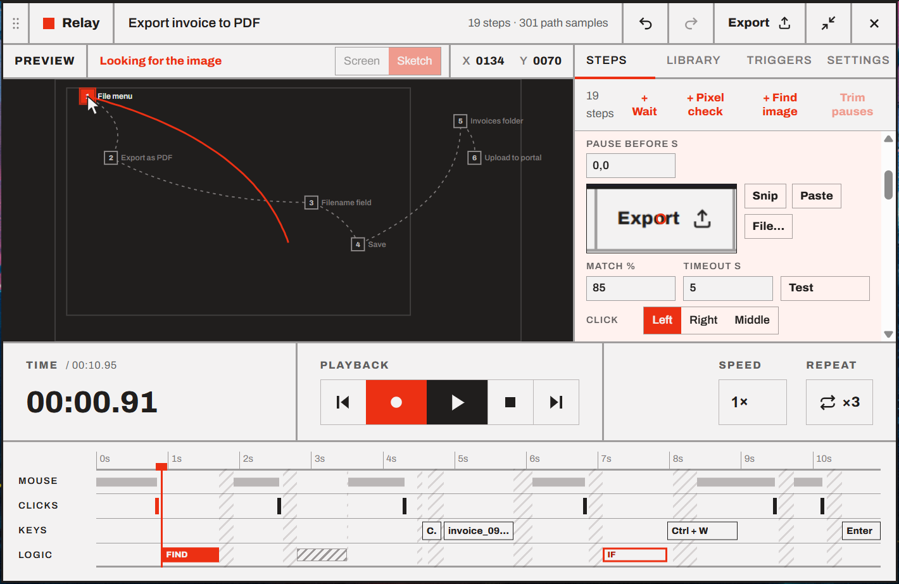

# Find image

A Find image step makes a macro **wait until a picture appears on screen, then click it**: a button, an icon, a link. The picture can be anywhere, and at another size than you took it: Relay looks for it on the whole screen. In the steps list it's the `FIND` step:

> **FIND** · Find image · OK button · *Left click when found · timeout 5 s, else stop*

It's the step to use when a click's position changes from one run to the next: a button that moves with the window, a dialog that opens somewhere else, an item in a list that isn't always in the same row.

- [How it works](#how-it-works)
- [Adding one](#adding-one)
- [Adjusting it](#adjusting-it)
- [Another size](#another-size)
- [When the image isn't found](#when-the-image-isnt-found)
- [Choosing a good image](#choosing-a-good-image)
- [Example: accept a dialog wherever it opens](#example-accept-a-dialog-wherever-it-opens)

## How it works

When playback reaches the step:

1. The playhead **stops**, and Relay looks for the image on the screen about **4 times a second**.
2. As soon as it finds it, it **clicks it** at the point you chose (the middle, unless you pick another), and playback **continues right away**.
3. If it doesn't find it within the **timeout**, playback **stops**.

Found means **at least as similar as Match %** (85% by default). Relay compares shades, not exact colors, so the image is still found when it's a little lighter or darker (a hovered button, say).

On the timeline, the step is a `FIND` block in the *Logic* lane. Like a [pixel check](05-pixel-checks.md), its length is only there to make it visible and clickable: when the image is already there, the macro doesn't spend that time waiting.

> [!NOTE]
> Relay never looks inside its own window, so the copy of the image in the step editor is never the one found. Nor does it see what's behind the widget, which a click couldn't reach: keep the widget off the thing to click. (A window in front of the widget, like a dialog opening over it, is seen.)

## Adding one

1. **Click the step the macro should do it after.** The new step goes right after it.
2. **Get the screen ready**: make the thing to click visible.
3. Press **+ Find image**. Windows' snipping overlay opens: **drag a rectangle around the thing to click**.

Relay inserts an 800 ms `FIND` block that left-clicks the middle of the image, at an 85% match, with a timeout of **5 s**.

Already have a picture of it? While the snip waits, press **Paste** to use the picture on the clipboard (a screenshot you copied, say), or **File…** for a PNG or JPEG file. <kbd>Esc</kbd> closes the snipping overlay; then press **Cancel**.

Relay keeps pictures up to 512 pixels on their longest side (larger ones are shrunk). It refuses one that's smaller than 8 pixels, or so plain (one flat color) that it could be anywhere.

## Adjusting it

Click the `FIND` row to open its editor:

| Field | Meaning |
| --- | --- |
| **The image** | What to look for. **Click it where it should be clicked**: a red circle shows the point. |
| **Snip**, **Paste**, **File…** | Replace the image. The click point goes back to its middle. |
| **Match %** | How similar the screen must be, 50 to 100. Lower finds more, and risks the wrong thing. |
| **Timeout s** | How long to look before giving up, in steps of 0.5 s |
| **Test** | Looks for the image once, now: *Found at 812, 440 (97%)*, or how close it came: *Not found: the best match is 61%* |
| **Show** | After a Test, marks that match on the screen itself for 3 seconds: a red outline around it and a red dot where the step would click. Also for a poor match, to see what Relay took for your image. |
| **Click** | **Left**, **Right** or **Middle** |
| **Look on** | With several monitors: **All screens**, or just one. One screen is faster. |
| **Label** | An optional note, such as *OK button* |

> [!TIP]
> Press **Test** with the screen as it will be during playback. Well above your Match % is a safe margin; a result close to it means the step may miss sometimes.

## Another size

The picture doesn't have to be the same size as on screen: Relay finds it from **half to twice** its size. That covers a screenshot taken on a monitor with other display scaling (100% and 150%, say), a zoomed-in screenshot, or a page zoomed in the browser. The click point grows or shrinks with it.

It still has to look the same: the same shape, not rotated, stretched one way only, or restyled (a new theme, dark mode).

## When the image isn't found

If the timeout runs out, Relay:

- stops playback and releases any held keys and buttons,
- shows *"Image not found at step 5; playback stopped."*,
- leaves the playhead **on that step** so you can see it highlighted.

The [run history](08-library.md#run-history) shows where and how quickly the image was found in the runs before.

| Cause | Fix |
| --- | --- |
| The app was slower than the timeout | Raise **Timeout** |
| It looks different now: hovered, selected, another theme | Snip it again as it looks during playback, or snip a smaller part that doesn't change |
| It's covered by another window, or by Relay's widget | Make sure nothing is on top of it: move the widget, or switch to the [compact player](README.md#a-tour-of-the-widget) |
| It's much bigger or smaller than the picture | Snip it again at the size it's shown |
| Match % is too strict | Press **Test**, and set Match % a little below what it says |

## Choosing a good image

- ✅ **Something distinctive**: a button with its label, an icon. Some text in it helps.
- ✅ **Just the thing, and a little around it.** A small picture is found faster, and is less likely to include something that changes.
- ❌ **Parts that change**: counters, times, blinking cursors, a list item's hover highlight.
- ❌ **Things there are several of**: an *OK* button when two dialogs are open. Relay clicks the best match, which may not be the one you meant. Include what makes it unique, or use **Look on** to search one screen only.

Looking for an image takes a moment of processor time, 4 times a second, and only while a `FIND` step is waiting. It's never a problem on a modern PC.

## Example: accept a dialog wherever it opens

An app asks *Save changes?* before closing, and the dialog opens wherever the app's window is.

1. Record closing the app: click the close button, then click **Save** in the dialog.
2. Open the dialog by hand, so it's on screen.
3. In the editor, click the step before the **Save** click, press **+ Find image**, and snip the **Save** button.
4. Delete the recorded **Save** click, which had a fixed position.

Now the macro clicks **Save** wherever the dialog opens, as soon as it's there.

> [!TIP]
> To run a macro **when** an image appears (an error dialog, a finished download), use the [When image appears](07-triggers.md#when-image-appears) trigger, and start the macro with a Find image step for the same image.

---

<a href="05-pixel-checks.md">← Pixel checks</a> · <a href="README.md">Contents</a> · <a href="07-triggers.md">Triggers →</a>

