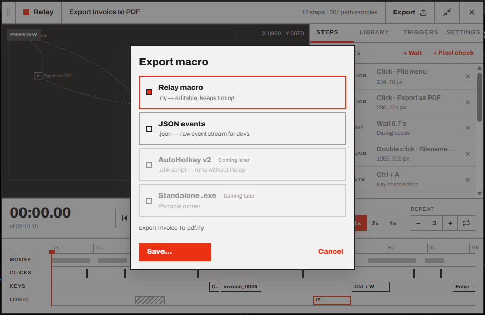

# Library, export and import

Every recording is saved automatically to your **Library**. From there you can open, duplicate, delete, export and import macros.

- [The Library tab](#the-library-tab)
- [Duplicate](#duplicate)
- [Delete and undo](#delete-and-undo)
- [Export](#export)
- [Import](#import)
- [Where your macros are stored](#where-your-macros-are-stored)
- [Backing up and moving to another PC](#backing-up-and-moving-to-another-pc)

## The Library tab

<p align="center"></p>

Each row shows:

| | |
| --- | --- |
| **Name** | The macro's name. The open macro is highlighted with a red bar. |
| **Hotkey** | Its [hotkey trigger](06-triggers.md#hotkey) if one is on, or **—** |
| **Length · steps · runs** | For example *10.9 s · 12 steps · 5 runs*. A run counts when the macro plays to the end. |
| **Last run** | *Today, 09:12*, *Fri, 17:40*, *Sep 12* or *Never* |

**Click a row** to open that macro in the editor. New recordings and imports go to the top.

Hover a row to see its **Duplicate** and **Delete** buttons. They're hidden while Relay is recording or playing.

## Duplicate

**Duplicate** makes a copy named *"… (copy)"*, just below the original, and opens it. Use it before big edits, or to make a variation of a macro.

The copy starts with **no triggers**, so the two macros don't compete for the same hotkey or schedule, and its run count starts at zero.

## Delete and undo

**Delete** moves the macro to the trash. A message at the bottom of the panel says *Moved "…" to the trash* with an **Undo** button, for about 8 seconds. Undo brings the macro back where it was, with its run count and triggers.

If you deleted the macro that was open, Relay opens the next one in the list.

> [!NOTE]
> After the Undo message is gone, the macro's file is still in the `macros\.trash` folder (see [below](#where-your-macros-are-stored)). To get it back, [import](#import) the file from there. Relay never empties the trash by itself: delete files from that folder to free the space.

## Export

<p align="center"></p>

1. Open the macro and press **Export** in the header.
2. Pick a format:

   | Format | File | Use it to |
   | --- | --- | --- |
   | **Relay macro** | `.rly` | Share or back up a macro. It can be imported back into Relay with all its steps, timing and playback options. |
   | **JSON events** | `.json` | Read or process the macro in your own tools. It's the same data, pretty-printed, plus the list of steps. Relay can import it too. |
   | AutoHotkey v2 | `.ahk` | *Coming later* |
   | Standalone .exe | `.exe` | *Coming later* |

3. Press **Save…** and choose where. The name defaults to the macro's name, like `export-invoice-to-pdf.rly`.

An export contains the macro's events, its playback options and a little about the PC it was recorded on (monitor layout, the window it was anchored to). It doesn't contain its triggers, run count or last run: those stay on your PC.

> [!WARNING]
> A macro contains everything you typed while recording it. Check the `TYPE` steps before sharing a macro file.

## Import

1. Open the **Library** tab and press **Import…** at the bottom.
2. Pick one or more `.rly` or `.json` files. Relay can read files from any version of Relay up to its own.

Imported macros go to the top of the Library, and the first one opens. Relay then tells you *Imported 3 macros*, or what went wrong with each file that didn't work:

| Message | Meaning |
| --- | --- |
| *not a Relay macro* | The file isn't a Relay export |
| *this macro was saved by a newer Relay (format version 2)* | Update Relay to open it |
| *invalid macro file: …* | The file is damaged or was edited by hand incorrectly |

If a macro with the same name exists, the imported one gets a number (*Daily report 2*). Importing a macro that's already in your Library adds a copy rather than replacing it. Imported macros have no triggers.

> [!IMPORTANT]
> A macro replays **screen positions and physical keys**. On a PC with a different monitor layout, display scaling or keyboard layout, clicks can land in the wrong place and keys can type different characters. Try [Window coordinates](04-playback.md#screen-or-window-coordinates), or record the macro again on that PC.

## Where your macros are stored

Everything is in `%APPDATA%\Relay` (usually `C:\Users\<you>\AppData\Roaming\Relay`). **Open macros folder** in the tray menu takes you there.

```text
%APPDATA%\Relay\
├── macros\
│   ├── <id>.rly        one file per macro
│   └── .trash\         deleted macros
├── library.json        the Library's order, run counts and triggers
├── settings.json       your settings
├── window.json         where the widget sits
└── logs\               diagnostics from the last 7 days
```

The `.rly` files are plain JSON, so they're easy to back up, keep in version control or look at. Their format is described in the [engineering guide](../engineering/file-formats.md).

## Backing up and moving to another PC

- **Back up everything:** quit Relay (tray → **Quit Relay**) and copy the whole `%APPDATA%\Relay` folder. Copy it back to restore, triggers and all.
- **Move some macros:** export them as `.rly` and import them on the other PC. Set up their triggers again there.

---

<p align="center"><a href="06-triggers.md">← Triggers</a> · <a href="README.md">Contents</a> · <a href="08-settings.md">Settings, tray and window →</a></p>
