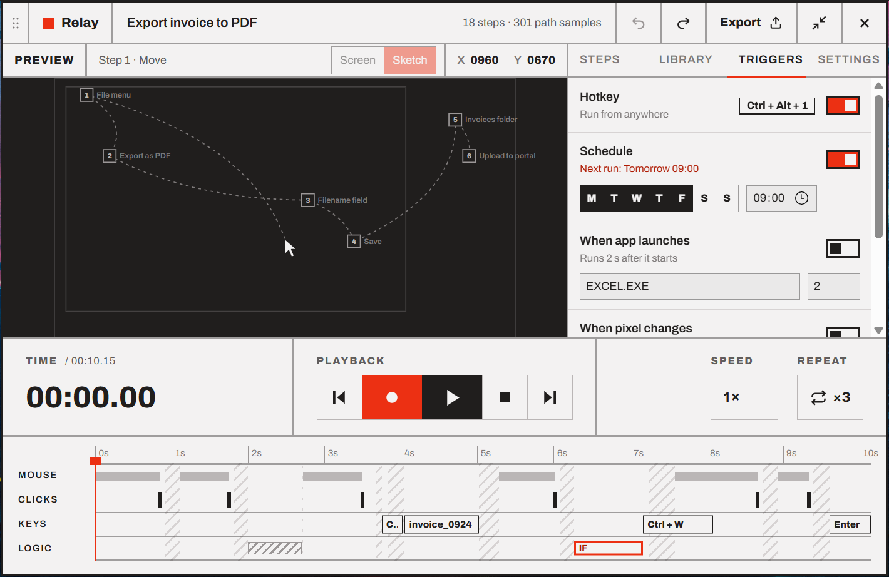

# Triggers

Triggers run a macro without you pressing play: on a hotkey, on a schedule, when an app starts, or when something changes or appears on screen. Each macro has its own triggers, in the **Triggers** tab.

- [The five triggers](#the-five-triggers)
- [Hotkey](#hotkey)
- [Schedule](#schedule)
- [When app launches](#when-app-launches)
- [When pixel changes](#when-pixel-changes)
- [When image appears](#when-image-appears)
- [When a trigger fires](#when-a-trigger-fires)
- [Pausing triggers](#pausing-triggers)
- [Keep Relay running](#keep-relay-running)

The tab shows the open macro's triggers. With no macro open it says so, and if they couldn't be loaded it shows *Couldn't load the triggers* with a **Retry** button.

## The five triggers

| Trigger | Runs the macro… | Example |
| --- | --- | --- |
| **Hotkey** | When you press a key combination, from any app | <kbd>Ctrl</kbd>+<kbd>Alt</kbd>+<kbd>1</kbd> fills in a form |
| **Schedule** | On chosen days at a set time | Weekdays at 09:00, export yesterday's report |
| **When app launches** | A few seconds after a program starts | When `EXCEL.EXE` starts, open the usual workbook |
| **When pixel changes** | When a pixel on screen turns a given color | When a build light turns red, take a screenshot |
| **When image appears** | When a picture shows up anywhere on screen | When an *Update available* dialog appears, click *Later* |

Each has a switch on the right. You can use several on the same macro. Triggers are saved on this PC only: they're not included when you [export](08-library.md#export) a macro.

## Hotkey

1. Click the key field (it shows **Set…** when empty). It changes to *Press keys…*.
2. Press the combination, for example <kbd>Ctrl</kbd>+<kbd>Alt</kbd>+<kbd>1</kbd>. The switch turns on by itself. (Until a hotkey is set, the switch is off and can't be turned on; the same goes for **When app launches** until you type a program.)

While the field is waiting for keys, <kbd>Backspace</kbd> clears the hotkey and <kbd>Esc</kbd> cancels.

**Rules for a hotkey:**

- It needs <kbd>Ctrl</kbd>, <kbd>Alt</kbd>, <kbd>Shift</kbd> or <kbd>Win</kbd>, so the key still types normally. Function keys <kbd>F1</kbd>–<kbd>F24</kbd> work on their own.
- <kbd>Shift</kbd> alone isn't enough for a letter, digit, punctuation, <kbd>Space</kbd> or <kbd>Enter</kbd>: that's ordinary typing (capital letters). It's fine with function keys, arrows, <kbd>Home</kbd>, <kbd>Tab</kbd> and the like.
- It can't be one of [Relay's own hotkeys](keyboard-shortcuts.md) (<kbd>F9</kbd>, <kbd>F10</kbd>, <kbd>Ctrl</kbd>+<kbd>Shift</kbd>+<kbd>M</kbd>, <kbd>Ctrl</kbd>+<kbd>Alt</kbd>+<kbd>End</kbd>).
- It can't already run another macro.

If something's wrong, the line under **Hotkey** says why, instead of *Run from anywhere*:

| Message | Meaning |
| --- | --- |
| *Add Ctrl, Alt, Shift or Win, so the key still types normally* | A plain key isn't allowed |
| *Add Ctrl, Alt or Win: Shift + A is ordinary typing* | Shift alone with a key that types |
| *Add a key after Shift: a hotkey can't end with a modifier* | Only modifiers were pressed |
| *Ctrl + Alt + 7 already runs "Fill weekly timesheet"* | Another macro has it. Pick another, or change that macro's. |
| *F9 is one of Relay's own hotkeys* | Reserved by Relay |
| *Ctrl + Alt + 1 is taken by another app* | Another program registered it first. Pick another, or close that program. |

Macro hotkeys only work while Relay is **idle**. During a recording or playback they reach other apps normally.

The Library shows each macro's hotkey next to its name.

> [!NOTE]
> The sample macros show the hotkeys from the design, but they're **off**, so you can't replay a sample on your desktop by accident.

## Schedule

1. Pick the **days**: **M T W T F S S**. Highlighted days are on.
2. Set the **time**.
3. Turn the switch on.

The line under **Schedule** shows when it will run next, for example *Next run: Tomorrow 09:00*, or *Off* while the switch is off, or *Pick a day* when no day is selected. A new schedule starts as **weekdays at 09:00**.

Things to know:

- Times are in your PC's local time, and they follow daylight saving changes.
- If the PC was asleep or off at the scheduled time, the run is **skipped**, not made up later. Relay still runs it if it notices up to 2 minutes late (the PC woke just after), but not later than that.
- If the clock jumps back (it's corrected after waking up, say), a run that already happened doesn't happen again.
- A schedule checks the clock every few seconds, so a run can start up to 5 seconds after the minute.

## When app launches

1. Type the program's file name, for example `EXCEL.EXE`. The field suggests programs that are running right now.
2. Set the **delay** in seconds (2 s by default). It gives the program's window time to appear before the macro starts clicking.
3. Turn the switch on.

The macro runs each time the program **starts**, counting from the moment you turn the trigger on: a program you open right after does count. A program that's already running then (or when Relay starts) doesn't count until it's closed and opened again. Relay looks for new programs every 2 seconds, so a program closed and reopened within 2 seconds may not be noticed. Opening a second window of a program that's already running doesn't count either, since the program didn't start.

If you turn the trigger off during the delay, the macro doesn't run.

> [!TIP]
> Not sure of the file name? Start the program, then open the field's suggestions, or look in Task Manager → **Details**.

## When pixel changes

1. Press **Pick**, then within 3 seconds point the mouse at the pixel to watch, **while it shows the color that should start the macro**. Or type **X**, **Y** and the **color** (`#RRGGBB`).
2. Turn the switch on.

The line under the title reads, for example, *1248, 680 becomes #EC3013*.

The trigger fires when the pixel **becomes** that color: it has to be a different color first, then match twice in a row (about half a second). A pixel that stays that color runs the macro **once**, not over and over. It fires again only after the pixel shows another color twice in a row too (so the mouse passing over it doesn't count), then comes back. Changing the trigger's position, color or tolerance starts over: the pixel has to change again.

Relay checks the pixel 4 times a second, with a tolerance of 8 per color channel. See [Choosing a good pixel](05-pixel-checks.md#choosing-a-good-pixel).

## When image appears

1. Press **Snip** and drag a rectangle around the thing to watch for, as it looks when the macro should start. Or **Paste** a picture from the clipboard, or choose a PNG or JPEG **File…**.
2. The switch turns on by itself with the first image. (Until there's an image, it's off and can't be turned on.)

The thumbnail shows the image, and the line under the title the match it needs, for example *At a 85% match or better*. Set **Match %** (50 to 100) and, with several monitors, which screen to watch. **Test** looks for the image once, now, and says where it found it or how close it came; **Show** then marks that spot on the screen for 3 seconds (a red outline, with a dot in the middle).

Like the pixel trigger, it fires when the image **appears**: it has to be away twice in a row first, then be seen twice in a row (about a second). An image that stays on screen runs the macro **once**. Changing the image or the match starts over. The image may be anywhere, and from half to twice its size; see [Find image](06-find-image.md#another-size).

Relay looks twice a second, and only while an image trigger is on. It never looks inside its own window (the thumbnail isn't the image appearing), nor behind it.

> [!NOTE]
> An image that's already on screen when you turn the trigger on doesn't start the macro: it has to go away and come back. To try the trigger, turn it on, then make the image appear.

> [!TIP]
> The trigger only starts the macro; it doesn't know where to click. To click what appeared, wherever it is, start the macro with a [Find image](06-find-image.md) step for the same image.

## When a trigger fires

A triggered macro plays **from the start**, with its own speed, repeat and other playback options. Its run count and *last run* go up as usual.

A trigger doesn't run the macro when:

| Situation | What happens |
| --- | --- |
| Relay is already recording or playing | It's skipped, and Relay tells you: *Skipped "Export invoice to PDF": Relay was busy* |
| The screen is locked, or a UAC prompt is up | It's skipped silently, since nothing could be clicked |
| Triggers are paused | Nothing happens |
| Relay isn't running | Nothing happens. See [Keep Relay running](#keep-relay-running). |

The [run history](08-library.md#run-history) lists each triggered run, and each skipped one, with the trigger that fired it.

You can stop a triggered macro like any other: <kbd>Esc</kbd>, any key (with *Stop on key press*), or the [kill switch](04-playback.md#the-kill-switch).

## Pausing triggers

The kill switch <kbd>Ctrl</kbd>+<kbd>Alt</kbd>+<kbd>End</kbd> pauses **all** triggers, so a looping schedule can't start again right after you stopped it. Relay says *"Triggers are paused. Resume them from the tray or the Triggers tab."*, and the Triggers tab shows a banner:

> Triggers are paused (kill switch) **Resume**

To resume, press **Resume** in the banner, or check **Triggers active** in the tray menu. You can also uncheck **Triggers active** in the tray yourself, to pause every trigger at once without turning them off one by one.

## Keep Relay running

Triggers only work while Relay runs. To make sure it's always there:

- Keep **Settings → Window → Close to tray** on (the default). Closing the widget then hides it to the tray instead of quitting.
- Turn on **Settings → Window → Start with Windows**. Relay then starts hidden in the tray when you sign in.

See [Settings, tray and window](09-settings.md).

---

<a href="06-find-image.md">← Find image</a> · <a href="README.md">Contents</a> · <a href="08-library.md">Library, export and import →</a>

