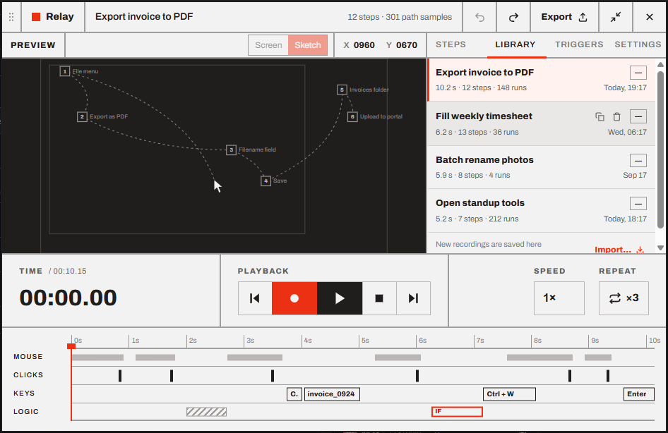
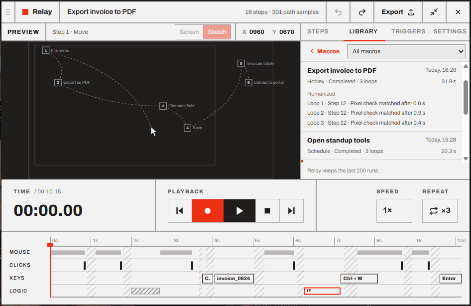
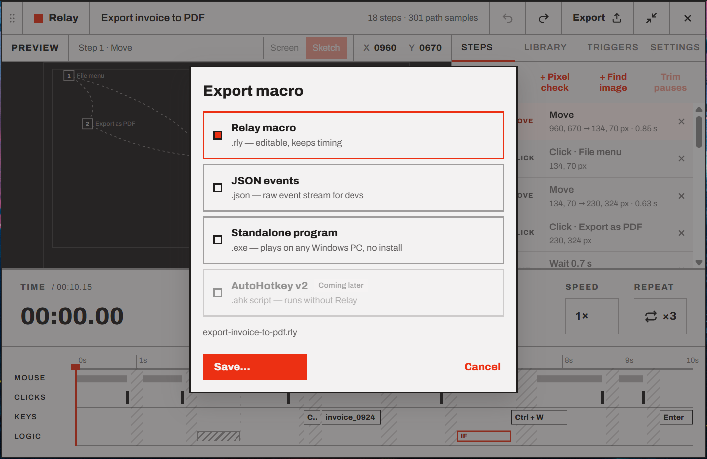
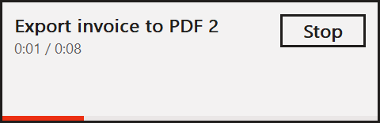

# Library, export and import

Every recording is saved automatically to your **Library**. From there you can open, duplicate, delete, export and import macros.

- [The Library tab](#the-library-tab)
- [Run history](#run-history)
- [Duplicate](#duplicate)
- [Delete and undo](#delete-and-undo)
- [Export](#export)
- [Exported programs](#exported-programs)
- [AutoHotkey scripts](#autohotkey-scripts)
- [Import](#import)
- [Where your macros are stored](#where-your-macros-are-stored)
- [Backing up and moving to another PC](#backing-up-and-moving-to-another-pc)

## The Library tab

<p align="center"></p>

An empty Library says *No macros yet — press Record (F9) to make one.* Each row shows:

| | |
| --- | --- |
| **Name** | The macro's name. The open macro is highlighted with a red bar. |
| **Hotkey** | Its [hotkey trigger](07-triggers.md#hotkey) if one is on, or **—** |
| **Length · steps · runs** | For example *10.9 s · 12 steps · 5 runs*. A run counts when the macro plays to the end. The [run history](#run-history) lists every run. |
| **Last run** | *Today, 09:12*, *Fri, 17:40*, *Sep 12* or *Never* |

**Click a row** to open that macro in the editor. New recordings and imports go to the top.

Hover a row to see its **Duplicate** and **Delete** buttons. They're hidden while Relay is recording or playing.

## Run history

Press **Runs** at the bottom of the Library tab to see what ran, and when. **Macros** at the top goes back to the list; the menu next to it shows one macro's runs, or all of them.

<p align="center"></p>

Each run shows the macro's name (as it was then), when it started, and:

| | |
| --- | --- |
| **What started it** | *Play* (the Play button or <kbd>F10</kbd>), *Hotkey*, *Schedule*, *App launch*, *Pixel trigger* or *Image trigger* |
| **How it ended** | *Completed*, *Stopped*, *Stopped by a key*, *Kill switch*, *Pixel check timed out*, *Image not found* or *Failed* |
| **Loops** | How many loops it played, when more than one |
| **Duration** | From start to end, pauses included |

Runs that didn't end as planned have a red bar. Click a run to see what its [pixel checks](05-pixel-checks.md) and [Find image](06-find-image.md) steps did (*Step 4 · Pixel check matched after 1.2 s*, *Step 6 · Image found at 812, 344 (93 %) after 0.4 s*), and its playback settings if they weren't the usual ones (*From 00:03.20 · 2× speed · Humanized*). A run keeps its last 50 checks.

The history also lists [triggers](07-triggers.md) that fired but didn't run their macro: *Skipped: Relay was busy*, *Skipped: screen locked*, and *Skipped: PC was asleep* for a scheduled run the PC slept through.

Relay keeps the last 200 runs, in `runs.json`. A run still going when you quit Relay isn't recorded.

## Duplicate

**Duplicate** makes a copy named *"… (copy)"* (then *"… (copy) 2"*, and so on), just below the original, and opens it. Use it before big edits, or to make a variation of a macro.

The copy starts with **no triggers**, so the two macros don't compete for the same hotkey or schedule, and its run count starts at zero.

## Delete and undo

**Delete** moves the macro to the trash. A message at the bottom of the panel says *Moved "…" to the trash* with an **Undo** button, for about 8 seconds. Undo brings the macro back where it was, with its run count and triggers. You stay on the macro you're editing, unless the deleted one was the open one. If another macro took its hotkey in the meantime, it comes back with that hotkey off, and a message says so.

If you deleted the macro that was open, Relay opens the next one in the list.

> [!NOTE]
> After the Undo message is gone, the macro's file is still in the `macros\.trash` folder (see [below](#where-your-macros-are-stored)). To get it back, [import](#import) the file from there. Relay never empties the trash by itself: delete files from that folder to free the space.

## Export

<p align="center"></p>

1. Open the macro and press **Export** in the header.
2. Pick a format:

   | Format | File | Use it to |
   | --- | --- | --- |
   | **Relay macro** | `.rly` | Share or back up a macro. It can be imported back into Relay with all its steps, timing and playback options. |
   | **JSON events** | `.json` | Read or process the macro in your own tools. It's the same data, pretty-printed, plus the list of steps. Relay can import it too. |
   | **Standalone program** | `.exe` | Play the macro on any Windows PC, even without Relay. See [Exported programs](#exported-programs). |
   | **AutoHotkey v2** | `.ahk` | Read, change or run the macro as a script, with [AutoHotkey](https://www.autohotkey.com/) v2. See [AutoHotkey scripts](#autohotkey-scripts). |

3. Press **Save…** and choose where. The name defaults to the macro's name, like `export-invoice-to-pdf.rly`. (A program is never named `relay.exe`: a macro named *Relay* is exported as `relay-macro.exe`.)

An export contains the macro's events, its playback options and a little about the PC it was recorded on (monitor layout, the window it was anchored to). It includes the pictures its [Find image](06-find-image.md) steps look for. It doesn't contain its triggers, run count or last run: those stay on your PC.

> [!WARNING]
> A macro contains everything you typed while recording it, and so does a program exported from it. Check the `TYPE` and `TEXT` steps before sharing a macro file or a program.

## Exported programs

A macro exported as a **Standalone program** is an `.exe` that plays it on any Windows 10 or 11 PC, without Relay. Nothing to install: copy it, double-click it.

<p align="center"></p>

1. A small window opens in a corner of the screen (one the macro doesn't click in) and counts down **3, 2, 1**. Use those seconds to click into the app the macro works in: the window never takes the focus.
2. The macro plays with the playback options saved with it: speed, repeats, *Humanize*, *Stop on key press* and *Window* coordinates. The window shows the time, the loop and a progress bar. [Text steps](03-editing.md#text-that-changes-each-run) fill in the date, the time and the clipboard of the PC it plays on. A macro with a [data file](04-playback.md#a-data-file-one-run-per-row) plays once per row of the file as it was when you exported it: export again after changing it. Relay won't export one whose file it can't play (missing, or without a column a Text step types), and says why.
3. When it's done, the window says *Done* and closes by itself.

Stop it with the window's **Stop** button, <kbd>Esc</kbd>, or the <kbd>Ctrl</kbd>+<kbd>Alt</kbd>+<kbd>End</kbd> kill switch (or any key, if the macro stops on a key press). Anything it was holding is released. Drag the window by its text to move it.

If something goes wrong, the window stays open and says what: *Pixel check timed out at step 7*, *Image not found at step 5*, a locked screen, or an app running as administrator, which Windows won't let the program send input to (run the program as administrator to automate it). Press **Close** when you've read it.

> [!NOTE]
> If the macro clicks in every corner of the screen, the window lets clicks go through it to the app below, so its **Stop** button can't be clicked: use <kbd>Esc</kbd> instead.

### Options

Run it from a command line, a shortcut or a scheduled task to change how it plays:

| Option | Does |
| --- | --- |
| `--repeat N` or `--repeat forever` | Plays it *N* times, or until stopped, instead of the saved repeat. A macro with a data file plays once per row whatever this says. |
| `--speed X` | Plays *X* times faster (`0.5` is half speed), from 0.01 to 100 |
| `--no-countdown` | Starts right away |
| `--quiet` | Shows no window at all. Stop it with <kbd>Esc</kbd> or the kill switch. |
| `--help` | Lists the options |

For example: `export-invoice.exe --repeat 3 --no-countdown`.

### Exit codes

The program's exit code says how it ended, for scripts and Task Scheduler (*Last Run Result*):

| Code | Meaning |
| --- | --- |
| 0 | Completed |
| 1 | Error: the macro couldn't be read, or playback failed |
| 2 | Bad options (the message says which) |
| 3 | Stopped: the **Stop** button, <kbd>Esc</kbd>, or a key press |
| 4 | Stopped by the kill switch |
| 5 | A pixel check or Find image step timed out |
| 6 | The screen was locked, so nothing was played |

In a script, wait for it to end: `start /wait export-invoice.exe --quiet` in `cmd` (then `%ERRORLEVEL%`), or `(Start-Process .\export-invoice.exe -ArgumentList '--quiet' -Wait -PassThru).ExitCode` in PowerShell.

> [!IMPORTANT]
> Exported programs aren't code-signed. On a PC that downloaded or received one, Windows SmartScreen may say *Windows protected your PC*: choose **More info → Run anyway**. An antivirus may be wary of it too, since it presses keys and clicks like a person would. See [Troubleshooting](10-troubleshooting.md#installing).

## AutoHotkey scripts

A macro exported as **AutoHotkey v2** is a script you can read, change and run with [AutoHotkey](https://www.autohotkey.com/) v2, without Relay. Each step is a short block, numbered like the steps list:

```autohotkey
Play(N) {
    ; 2. Click · Save
    Pause(100)
    Click "840 412"
    ; 3. Keys · Ctrl + S
    Pause(300)
    Send "^s"
    ; 6. Text
    Pause(300)
    SendText "Invoice " . FormatTime(, "yyyy-MM-dd") . " #" . N
}
```

- **Running it.** Double-click the `.ahk` (with AutoHotkey v2 installed). A tooltip counts down 3 seconds: click into the app the macro works in. It then plays and exits.
- **Stopping it.** <kbd>Ctrl</kbd>+<kbd>Alt</kbd>+<kbd>End</kbd>, and <kbd>Esc</kbd> if the macro stops on a key press. Keys it was holding are released.
- **Options** are variables at the top: `Speed`, `Repeat` (0 loops until stopped), `Jitter` (Humanize, in ms; 0 plays exactly) and `Countdown`. A macro with a [data file](04-playback.md#a-data-file-one-run-per-row) has its rows in `Rows` and plays once per row; Relay won't export it if the file can't be played, as for a program.
- **Timing.** Each step starts when it did, relative to the step before; waits are those pauses. Pixel checks and Find image steps wait for what they look for, up to their timeout, then stop the script with a message.
- **Mouse.** Clicks, drags and scrolls are at the screen coordinates they were recorded at, with any key held over them (a Shift-click). A mouse path is a jump to where it ends. The script ignores the *Window* coordinates option.
- **Text.** Typed text and Text steps are sent as characters. `{date}`, `{time}`, `{clipboard}`, `{n}` and `{col:…}` are filled in when the script plays.
- **Find image** steps carry their picture inside the script. AutoHotkey's `ImageSearch` compares pixels rather than shapes: it finds the picture only at the size it was taken, and less forgivingly than Relay. The threshold becomes its color variation (85 % allows 30 levels).

> [!NOTE]
> Relay doesn't run the scripts it writes in its tests: try one on your own macro before you rely on it.

## Import

1. Open the **Library** tab and press **Import…** at the bottom (it's off while recording or playing).
2. Pick one or more `.rly` or `.json` files, or programs exported by Relay (`.exe`: Relay reads the macro back out of them). Relay can read files from any version of Relay up to its own. (A macro with Find image steps needs Relay 1.4 or later, and one with Text steps Relay 1.5 or later; older versions say it was saved by a newer Relay.)

Imported macros go to the top of the Library, and the first one opens. Relay then tells you *Imported 3 macros*, or what went wrong with each file that didn't work:

| Message | Meaning |
| --- | --- |
| *not a Relay macro* | The file isn't a Relay export |
| *not a program exported by Relay* | The `.exe` is another program |
| *this macro was saved by a newer Relay (format version 2)* | Update Relay to open it |
| *invalid macro file: …* | The file is damaged or was edited by hand incorrectly |

If a macro with the same name exists, the imported one gets a number (*Daily report 2*), or the next one if its name already ends in a number (*Daily report 2* becomes *Daily report 3*). Importing a macro that's already in your Library adds a copy rather than replacing it. Imported macros have no triggers.

> [!IMPORTANT]
> A macro replays **screen positions and physical keys**. On a PC with a different monitor layout, display scaling or keyboard layout, clicks can land in the wrong place and keys can type different characters. Try [Window coordinates](04-playback.md#screen-or-window-coordinates), or record the macro again on that PC.

## Where your macros are stored

Everything is in `%APPDATA%\Relay` (usually `C:\Users\<you>\AppData\Roaming\Relay`). **Open macros folder** in the tray menu takes you there.

```text
%APPDATA%\Relay\
├── macros\
│   ├── <id>.rly        one file per macro
│   └── .trash\         deleted macros
├── library.json        the Library's order, run counts and triggers
├── runs.json           the run history
├── settings.json       your settings
├── window.json         where the widget sits
└── logs\               diagnostics from the last 7 days
```

The `.rly` files are plain JSON, so they're easy to back up, keep in version control or look at. Their format is described in the [engineering guide](../engineering/file-formats.md).

## Backing up and moving to another PC

- **Back up everything:** quit Relay (tray → **Quit Relay**) and copy the whole `%APPDATA%\Relay` folder. Copy it back to restore, triggers and all.
- **Move some macros:** export them as `.rly` and import them on the other PC. Set up their triggers again there.

---

<p align="center"><a href="07-triggers.md">← Triggers</a> · <a href="README.md">Contents</a> · <a href="09-settings.md">Settings, tray and window →</a></p>
