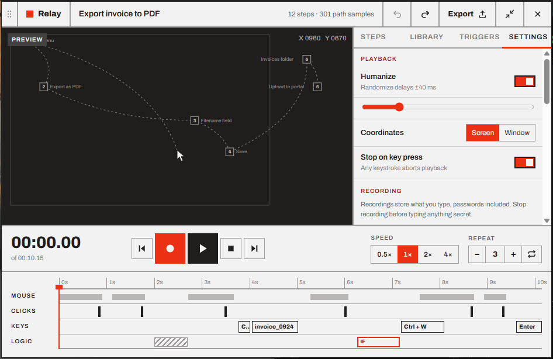

# Settings, tray and window

- [The Settings tab](#the-settings-tab)
- [The widget window](#the-widget-window)
- [The tray icon](#the-tray-icon)
- [Start with Windows](#start-with-windows)
- [Logs](#logs)
- [Uninstall](#uninstall)

## The Settings tab

Settings save as soon as you change them.

### Playback, for the open macro

These belong to the macro that's open and are saved in its file, so each macro can have its own. See [Playing back](04-playback.md).

| Setting | Default | What it does |
| --- | --- | --- |
| **Humanize** | On, ±40 ms | Shifts each step by a random amount up to the slider value (0–200 ms) |
| **Coordinates** | Screen | **Screen** clicks at the recorded pixels. **Window** follows the recorded window if it moved. |
| **Stop on key press** | On | Any key you press stops playback (and is swallowed) |

### Recording

These apply to every new recording. See [Recording](02-recording.md#recording-options).

| Setting | Default | What it does |
| --- | --- | --- |
| **Capture mouse path** | On | Records cursor movement between clicks |
| **Capture keystrokes** | On | Records the keyboard |
| **3-second countdown** | On | Counts down before recording starts |
| **Esc stops recording** | On | Off, <kbd>Esc</kbd> is recorded like any key, and <kbd>F9</kbd> stops the recording |
| **Ignore simulated input** | On | Leaves out input generated by other programs. Turn it off for remote-desktop and KVM tools. |

### Preview

| Setting | Default | What it does |
| --- | --- | --- |
| **Mouse path** | Full path | **Full path** draws the whole path. **Trail only** draws only the part already played. |
| **Click labels** | On | Shows click labels next to the numbered click markers |

### Window

| Setting | Default | What it does |
| --- | --- | --- |
| **Keep on top** | Always | When the widget floats above other windows: **Always**, **While recording or playing** (a normal window the rest of the time), or **Never** |
| **Close to tray** | On | The **×** button and <kbd>Alt</kbd>+<kbd>F4</kbd> hide Relay to the tray. Hotkeys and triggers keep running. Off, they quit Relay. |
| **Start with Windows** | Off | Starts Relay in the tray when you sign in, so triggers run without you opening it |

### Global hotkeys

The list at the bottom is a reminder of Relay's own hotkeys. They can't be changed in v1. See [Keyboard shortcuts](keyboard-shortcuts.md).

## The widget window

By default Relay's widget floats **on top** of other windows, so the stop button and the steps stay in view while you work in other apps. **Settings → Window → Keep on top** makes it float only while recording or playing, or never.

- **Move it** by dragging the dotted grip on its left edge. Relay remembers where you left it, even after a restart.
- **Where it sits:** it stays anchored by its bottom-center, so switching between the compact player and the editor grows or shrinks it upward, around the same point. It never goes off screen or under the taskbar. If the monitor it was on is gone, it comes back at the bottom of the main monitor.
- **Small screens:** if the editor doesn't fit (a small laptop screen or high display scaling), Relay shrinks it to fit, down to 40%.
- **Focus:** during a recording or playback, clicking the widget doesn't take the keyboard away from the app you're working in.
- **One Relay at a time:** starting Relay again while it's running just brings the existing widget to the front.

## The tray icon

Relay's icon sits in the notification area of the taskbar. Hover it to see what Relay is doing (*Relay — recording (F9 to stop)*, *Relay — playing (Esc to stop)*…).

**Left-click** shows or hides the widget. **Right-click** opens the menu:

| Item | Does |
| --- | --- |
| **Show / hide Relay** | Same as left-click |
| **Record** <kbd>F9</kbd> | Starts or stops a recording |
| **Stop** <kbd>Esc</kbd> | Stops the recording or playback |
| **Triggers active** | Checked while triggers can run. Uncheck it to pause them all, check it to resume. See [Pausing triggers](06-triggers.md#pausing-triggers). |
| **Open macros folder** | Opens `%APPDATA%\Relay` in Explorer |
| **Quit Relay** | Quits for real. Hotkeys and triggers stop. |

> [!TIP]
> Windows may hide new tray icons under the **^** arrow. Drag Relay's icon onto the taskbar to keep it visible, or turn it on in **Settings → Personalization → Taskbar → Other system tray icons**.

## Start with Windows

With **Start with Windows** on, Relay starts **hidden in the tray** each time you sign in. Nothing pops up, but hotkeys and triggers are ready. Click the tray icon to open the widget.

It's a per-user setting (in the *Run* list of your Windows account). You can also turn it off in Task Manager → **Startup apps**.

## Logs

Relay writes a diagnostic log to `%APPDATA%\Relay\logs`, one file per day, keeping the last 7 days. It records what Relay did: sessions starting and stopping, triggers firing or being skipped, errors, playback timing. It **never records what you type** or the contents of your macros.

If you report a problem, attaching the log of that day helps a lot.

## Uninstall

Uninstall Relay from **Settings → Apps → Installed apps**. For the portable .exe, just delete the file. Your macros and settings in `%APPDATA%\Relay` are left in place, in case you reinstall. Delete that folder to remove them too.

---

<a href="07-library.md">← Library, export and import</a> · <a href="README.md">Contents</a> · <a href="09-troubleshooting.md">Troubleshooting and FAQ →</a>

