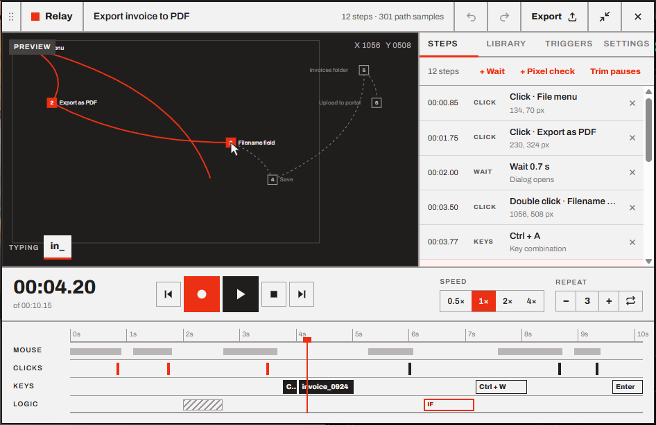
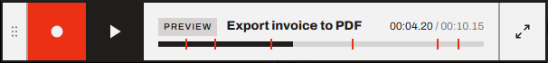

# User guide

Relay is a macro recorder for Windows. It watches what you do with the mouse and keyboard, turns it into a list of steps you can read and edit, and replays it on demand or on its own.

## A tour of the widget

Relay lives in a small window that stays on top of your other windows (you can [change that](08-settings.md#window)). It has two sizes: the **expanded editor** and the **compact player**. Switch between them with <kbd>Ctrl</kbd>+<kbd>Shift</kbd>+<kbd>M</kbd> or the arrows button in the top-right corner.

  

| Part | What it does |
| --- | --- |
| **Header** | Drag the dotted grip to move the widget. Click the name to rename the macro. **Undo** and **Redo** step back and forward through your edits, **Export** saves the macro as a file, and **×** hides Relay to the tray. |
| **Preview** | The mouse path over a sketch of your screen. Numbered squares are clicks, and the part already played turns red. The bottom-left corner shows keys and typed text as they happen. |
| **Steps** | The macro as a list: clicks, key combinations, typed text, waits and pixel checks. Click a step to jump to it and edit it. |
| **Library** | All your macros. New recordings are saved here automatically. |
| **Triggers** | Run the macro on a hotkey, on a schedule, when an app starts or when a pixel changes. |
| **Settings** | Playback, recording, preview and window options. |
| **Transport** | The time, previous/next step, **record**, **play/pause**, **stop**, the speed and the number of repeats. |
| **Timeline** | Four lanes (*Mouse*, *Clicks*, *Keys* and *Logic*, meaning waits and pixel checks) with a playhead you can drag. |

The compact player keeps the essentials in a thin bar:

  

## Contents

1. **[Getting started](01-getting-started.md):** install Relay and make your first macro in two minutes.
2. **[Recording](02-recording.md):** what gets captured, what doesn't, and how to record well.
3. **[Editing steps](03-editing.md):** the step types, the editor, waits, labels and the timeline.
4. **[Playing back](04-playback.md):** speed, repeats, Humanize, stopping, and where input goes.
5. **[Pixel checks](05-pixel-checks.md):** wait until something on screen changes before continuing.
6. **[Triggers](06-triggers.md):** hotkeys, schedules, app launches and pixel changes.
7. **[Library, export and import](07-library.md):** organizing, sharing and backing up macros.
8. **[Settings, tray and window](08-settings.md):** every option, explained.
9. **[Troubleshooting and FAQ](09-troubleshooting.md):** when something doesn't do what you expect.

⌨️ **[Keyboard shortcuts](keyboard-shortcuts.md):** everything on one page.

---

<a href="../README.md">Documentation home</a> · <a href="01-getting-started.md">Getting started →</a>

